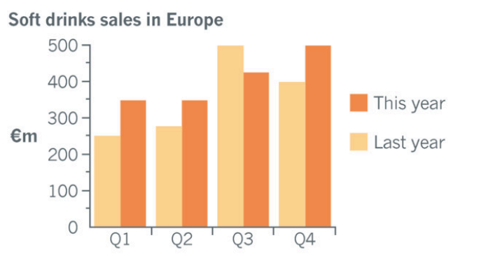
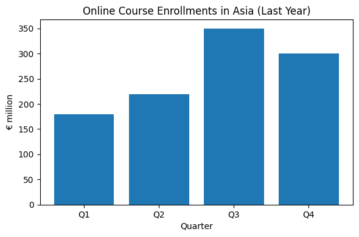

# Business English for Customer Interaction — Module 02 Textbook

> Source: `F1_M02_Textbook.pdf` — 130 pages

<!-- Source: F1_M02_Textbook.pdf, page 1 -->

## EF1

## MODULE 02

## BUSINESS ENGLISH FOR

## CUSTOMER INTERACTION

<!-- Source: F1_M02_Textbook.pdf, page 2 -->

### EF1

### BUSINESS ENGLISH FOR

### CUSTOMER INTERACTION

### Table of Content

**Lesson 01:** Opening a Meeting

**Lesson 02:** Participating in a Meeting

**Lesson 03:** Agreeing and Disagreeing

**Lesson 04:** Closing a Meeting

**Lesson 05:** Revision

**Lesson 06:** Virtual Presentations

**Lesson 07:** Confident Openings

**Lesson 08:** Delivering Key Ideas

**Lesson 09:** Presenting with Impact

**Lesson 10:** Revision

**Lesson 11:** Handling Workplace Negotiations

**Lesson 12:** Negotiation Tactics in Action

**Lesson 13:** Managing Workplace Conflicts

**Lesson 14:** Conflict Resolution Strategies

**Lesson 15:** Revision

**Lesson 16:** Explaining Features and Benefits

**Lesson 17:** Persuasive Selling

**Lesson 18:** Describing trends

**Lesson 19:** Receiving and Handling Feedback

**Lesson 20:** Final Revision

<!-- Source: F1_M02_Textbook.pdf, page 3 -->

## Lesson 01

## Opening A Meeting

## Warm-Up

1. What are some effective ways to start a meeting?

2. What are some common mistakes to avoid when starting a meeting?

<!-- Source: F1_M02_Textbook.pdf, page 4 -->

## Meeting Opening Examples

Read the three meeting opening examples aloud. Then, sort them into the correct categories: face-to-face, virtual, and mixed setting.

Example 1 “Welcome, team! I’m glad to see some of you here in the room and others joining remotely. Let’s make sure everyone is connected and ready before we dive into the objectives.”

Example 2 “Hello, everyone! Can you hear me clearly? Please make sure your microphones are muted unless you’re speaking. Let’s begin by reviewing today’s agenda.”

Example 3 “Good morning, everyone. Thank you for being here today. Let’s settle in and get started. I appreciate you taking the time to join this important discussion.”

Examples Analysis

Answer the following questions:

1. Which example checks technical readiness before starting?

2. Which example gives a clear signal of the meeting structure? (Look for agenda or objectives.)

3. Compare the tone in Example 1 and Example 3 — which is warmer and more personal? Why?

<!-- Source: F1_M02_Textbook.pdf, page 5 -->

## Opening a Meeting: Flow and Phrases

A. Flow of an Opening

1. Welcoming and Greeting - Acknowledge participants and set a friendly tone.

2. Meeting Purpose - State the reason for the meeting.

3. Agenda - Outline key topics to be covered.

4. Housekeeping - Give practical or technical instructions.

5. Encouraging Participation - Invite input and confirm readiness.

6. Transition - Move smoothly to the first agenda item.

B. Phrases for Opening a Meeting

| Stage in Opening a Meeting | Offline Meeting Phrases | Online Meeting Phrases | Hybrid Meeting Phrases |
| --- | --- | --- | --- |
| 1. Welcome & Greeting | “Good morning/afternoon, everyone.” “It’s great to see you all here today.” | “Hello team, can everyone hear me clearly?” “Thanks for joining the call.” | “Good morning/afternoon to those here in the room, and those joining online.” |
| 2. Purpose of the Meeting | “The aim / purpose of today’s meeting is to…” “We’re here to discuss…” |   |   |
| 3. Agenda Overview | “Here’s the agenda for today.” “We have … main points to cover.” “Can everyone online see the shared screen about the agenda?” |   |   |
| 4. Ground Rules / Housekeeping | “Please switch phones to silent.” “We’ll take questions after each topic.” | “Please keep your microphone muted when you’re not speaking.” “Use the chat if you have questions.” “We’ll record this session for reference.” | “For those in the room — phones on silent; for those online — mute mics when not speaking.” “Let’s avoid cross- talk so everyone can hear clearly.” |

<!-- Source: F1_M02_Textbook.pdf, page 6 -->

| Stage in Opening a Meeting | Offline Meeting Phrases | Online Meeting Phrases | Hybrid Meeting Phrases |
| --- | --- | --- | --- |
| 5. Encouraging Participation | “I’d like to hear everyone’s views today.” “Please feel free to contribute at any time.” | “Don’t hesitate to unmute and share your ideas.” “Drop a quick ‘yes’ in the chat if you can hear me.” | “We’ll alternate between in-room and online comments.” “Feel free to raise your hand or use the chat.” |
| 6. Transition to First Agenda Item | “Let’s begin with our first point…” “Shall we start?” |   |   |

## Practice 1

### Instructions: Guess the meeting type based on the meeting description. Choose your

answer in the box.

Status Update Meeting Planning Meeting Progress Meeting Brainstorming Session Decision-Making Meeting

1. “We’ll be discussing the current project status, addressing any challenges, and setting goals for the next quarter.”

2. “We’ll be generating new ideas for our marketing campaign and exploring innovative approaches to reach our target audience.”

3. “We’ll be reviewing the company’s financial performance, discussing budget allocations, and making strategic for the upcoming year.”

4. “We’ll review the project scope, timeline, and budget, and work together to assign tasks and responsibilities.”

5. “We’ll review the current progress, discuss any challenges or obstacles, and provide updated un upcoming milestones.”

### Discussion: What are the characteristics of each meeting type?

<!-- Source: F1_M02_Textbook.pdf, page 7 -->

## Practice 2

### Instructions

Role-play each scenario, following the 6-step opening flow. Adapt your phrases to suit the meeting type (offline, online, hybrid) and theme. Use at least one useful phrase for each stage.

### Scenarios

1. Offline: Start a monthly sales performance review with your in ‑office sales team.

2. Online: Start a weekly cross ‑department project sync with colleagues from different countries.

3. Hybrid: Start a quarterly strategy meeting with the in ‑person leadership team and remote branch managers.

4. Online: Start a client onboarding meeting with a new customer to walk them through the first steps.

5. Offline: Start a product development brainstorming session with the marketing and design teams.

## Production

Be more confident in opening a meeting by answering the following questions.

1. How can you ensure that all attendees are aware of the meeting’s purpose or agenda?

2. How can you ensure that all attendees are engaged and focused from the beginning?

3. How can you ensure that all attendees understand their roles and responsibilities during the meeting?

4. How can you create a safe and respectful environment for open discussion?

5. What do you say to check if participants can hear you clearly?

6. How do you remind participants about microphone etiquette?

<!-- Source: F1_M02_Textbook.pdf, page 8 -->

7. What phrase do you use to confirm everyone sees the agenda or shared screen?

8. How do you greet participants who are in the room and those joining remotely?

9. What do you say to make sure both groups can interact smoothly?

10. How do you confirm that remote participants are connected and ready?

## Key Vocabulary

| Word/Phrase | Use | Example |
| --- | --- | --- |
| Kick-off | Used to signal the start of a new project or initiative | Good morning, everyone. Welcome to the kick-off meeting for our new project. |
| Outline | Used in providing a clear structure for the meeting | To ensure we cover all necessary topics, let me outline the agenda for today’s meeting. |
| Set objectives | Used to establish clear goals and expectations and to ensure that everyone is on the same page | Hello team. To ensure we’re all on the same page, let’s set our objectives for this project. |
| Go over | Used to review and clarify valuable information | Let’s go over the key takeaways from our last meeting to ensure we’re building on our previous discussions. |

<!-- Source: F1_M02_Textbook.pdf, page 9 -->

## Lesson 02

## Participating in a Meeting

## Warm-Up

1. Why is it important to get someone to participate and share ideas in a meeting?

2. Is it easy to get your colleagues to participate in meetings?

<!-- Source: F1_M02_Textbook.pdf, page 10 -->

## Role-Play

### Scenario: David is asking for everyone’s ideas during the meeting.

**Pia:** We need to create something that will link our future products together and can be controlled via smartphone.

**David:** That’s an interesting point, Pia. What do you think, Daniel?

**Daniel:** Well, we don’t currently have anything like that, and I think there’s a lot of potential there. Pia, could you further clarify the information needed on that?

**Pia:** We can use the information gathered for data analysis and statistics.

**Daniel:** I think it’s a good direction. We don’t currently have anything like that, and there’s a lot of potential here.

**Karla:** Sorry to jump in here, but could I add something to Daniel’s idea? I think it could be extremely useful for us and for our customers.

**Daniel:** If I could just finish my point, I was about to say we might need to check feasibility before moving ahead.

**Karla:** Of course, sorry - please go ahead.

**Daniel:** Thanks. I think a pilot project would help us understand the challenges first.

**David:** Great suggestion, Daniel. Karla, please continue.

**Karla:** Thanks. I’d like to add that we must create an entirely new system to manage the data.

**David:** Thank you for your input, Karla. Does anyone else have any additional ideas?

### Role-Play Analysis

Answer the following questions:

1. What did David do at the start of the meeting to invite ideas?

2. How did the participants contribute their ideas? Which phrases showed agreement or support?

3. What phrase did Karla use to interrupt politely?

<!-- Source: F1_M02_Textbook.pdf, page 11 -->

4. How did Daniel respond to being interrupted? What phrase did he use to continue his point?

5. Why is it important to interrupt politely or to handle interruptions professionally in a meeting?

6. How did the speakers make sure everyone had the chance to speak?

### Discussion

- In your workplace, how do people usually join in or add to an ongoing discussion? Is it similar or different from what you heard?

## Participating in a Meeting Useful Phrases

1. Asking for and Sharing Opinions

- What do you think about…?

- Does anyone have any ideas on…?

- I’d like to hear your thoughts on…

- Could you share your opinion on…?

- Any suggestions or feedback?

2. Interrupting and Contributing Ideas

- Excuse me, may I jump in? / Sorry, may I say something quickly?

- Can I have a word here? / Could I share an idea on this?

- I’d like to build on your idea.

- Sorry to interrupt, but…

- If I could add something…

3. Handling interruption

- If I could just finish my point… / Please let me finish.

- I’ll come back to you in a moment, but…

- Can I finish, and then I’d like to hear your idea?

- Let me just clarify, then you can respond.

<!-- Source: F1_M02_Textbook.pdf, page 12 -->

## Practice

A. Invite Opinions

Team up with a partner and practice asking for input by making statement and then asking your partner for their input.

| STATEMENT | ASK FOR INPUT |
| --- | --- |
| Our brand deserves to be recognized by more people. |   |
| Business attire during client meeting is best. |   |
| We should have a strict work-life balance policy. |   |
| We had better allocate our resources on the new system and technology. |   |

B. Active Participation

- Work in pairs or small groups.

- Each student prepares 2-3 points on a given topic.

- Use the phrases learned to: o Ask for opinions o Share your ideas o Interrupt politely o Ask for clarification

- Encourage active listening and respectful interruptions.

### Sample Discussion Topics

1. Improving Team Communication

2. Making Meetings More Effective

3. Reducing Workplace Stress

<!-- Source: F1_M02_Textbook.pdf, page 13 -->

## Production

To help you feel more confident and prepared when participating in cross-cultural meetings, answer the following questions.

1. What challenges might you face when asking for ideas in a real meeting?

2. How would you deal with someone who constantly interrupts?

3. In your culture, is interrupting during a meeting seen as normal or rude?

4. How can you make sure everyone feels included in a meeting, even if they have different cultural backgrounds?

5. What can you do to participate well when people have different cultural habits in meetings?

6. How can you encourage quieter team members to share their ideas?

7. What are some polite ways to interrupt or contribute in a multicultural setting?

8. How can you clarify misunderstandings without causing offense?

<!-- Source: F1_M02_Textbook.pdf, page 14 -->

## Key Vocabulary

| Word/Phrase | Use | Example |
| --- | --- | --- |
| Contribute | To add or provide an idea, suggestion, or expertise to the discussion | Can I contribute my thoughts on this topic? |
| Interrupt | To speak before someone has finished in order to ask a question, add information, or change the topic | Sorry to interrupt, but could I ask a quick question? |
| Build on | To add or expand on someone else’s idea or suggestion | I would like to build on Tim’s idea. |
| Jump in | To join a conversation suddenly, often to add a quick comment or idea | If I could just jump in, I think we should also consider the budget. |

<!-- Source: F1_M02_Textbook.pdf, page 15 -->

## Lesson 03

## Agreeing and Disagreeing

## Warm-Up

### Motivation Questions

1. In your workplace, do people usually agree with each other in meetings, or is there often disagreement? Why?

2. Can you remember a time when you agreed or disagreed with a colleague’s idea? What happened?

3. How does your culture usually handle disagreement - do people say it directly, politely, or avoid it?

<!-- Source: F1_M02_Textbook.pdf, page 16 -->

## Role-Play

**Person A:** I believe we should invest more in digital marketing. With so many people online, it’s a great way to reach more customers and see results quickly.

**Person B:** I see your point, and digital marketing is important. But I doubt it should be our top priority right now. If the product isn’t strong enough, marketing won’t convince people to buy it.

**Person A:** That’s a valid argument, but without strong marketing, we’ll miss attracting new customers. It can also give us valuable feedback for improving the product.

**Person B:** My opinion differs from yours. Feedback is useful, but focusing on product quality first will have a bigger impact.

**Person A:** I understand where you’re coming from, but I think otherwise. Competitors are already investing heavily in online campaigns, and we risk losing visibility if we wait.

**Person B:** I don’t completely agree with you here. We could run a small campaign alongside product improvements, but the main focus should stay on fixing issues.

**Person A:** That sounds like a reasonable plan. Let’s decide how to split the budget between the two.

### Role-play Analysis

1. What expressions did Person B use to disagree politely?

2. How did Person A express their agreement?

3. What could Person A say to acknowledge Person B's point before restating their own opinion?

### Discussion

1. What new words or phrases did you learn from the role-play?

2. What do you usually do when you disagree with your colleagues?

3. How does the tone of voice affect the perception of agreement or disagreement?

<!-- Source: F1_M02_Textbook.pdf, page 17 -->

## Pronunciation

Practice pronouncing the following words / phrases

- Agree /əˈɡriː/

- Disagree /ˌdɪsəˈɡriː/

- Perspective /pərˈspɛktɪv/

- Acknowledge /əkˈnɒlɪdʒ/

- Respectfully /rɪˈspɛktfəli/

- Partially /ˈpɑːʃəli/

- Doubt /daʊt/

## Vocabulary

| Agreeing | Neutral / Partial Agreement | Disagreeing Politely |
| --- | --- | --- |
| • I completely agree. • I couldn’t agree with you more. • That’s a good idea. • No doubt about it. • Absolutely, I think the same. • I’m with you. | • I agree to some extent. • I see your point, but… • That makes sense, although… • I understand where you’re coming from. | • I’m not sure I agree with that. • I see it differently. • I beg to differ. • I’d like to offer a different perspective. • I have a slightly different view. • I respect your opinion, but… |

<!-- Source: F1_M02_Textbook.pdf, page 18 -->

## Practice

Express your opinion

- Work in pairs.

- Each pair is given a statement.

- You must express your views on the statement using the target language.

- After 1–2 minutes, rotate to a new statement.

### Statements

1. It’s better to live in the countryside than the city.

2. Smartphones are making people less social.

3. It’s better to have one best friend than many friends.

4. People should work only four days a week.

5. AI will replace most jobs in the future.

## Production

**Activity 1:** Debate

**Topic:** "Remote work is more productive than office work."

### Instructions

1. Participants: Work in pairs/groups. One side will argue in favor of the statement (Pro), and the other will argue against it (Con).

2. Preparation: Each side should spend 05 minutes preparing their arguments.

They should consider various aspects such as productivity, work-life balance, communication, and company culture.

<!-- Source: F1_M02_Textbook.pdf, page 19 -->

### 3. Debate Structure

- Opening Statements: Each side presents their main arguments (02 - 03 minutes per side).

- Rebuttals: Each side responds to the opposing arguments (02 - 03 minutes).

- Open Debate: Participants engage in a back-and-forth discussion, using phrases for agreeing and disagreeing (05 minutes).

- Closing Statements: Each side summarizes their key points and makes a final appeal (02 - 03 minutes per side).

**Activity 2:** Giving Opinions through a Case Study

### 1. Preparation

- Work in small groups.

- Each group reads the case study and discusses the potential strategies.

- Each participant prepares their opinion on the best strategy to address the decline in sales.

### 2. Meeting Simulation

- One participant acts as the meeting facilitator.

- Each participant takes turns presenting their opinion on the best strategy (02 - 03 minutes per person).

- After each presentation, other participants can ask questions or provide feedback (01 - 02 minutes per person).

### 3. Group Discussion

- The facilitator leads a group discussion to compare and contrast the different opinions.

- Participants use phrases for agreeing and disagreeing to engage in a constructive debate.

- Afterwards, they will present their findings to the class.

<!-- Source: F1_M02_Textbook.pdf, page 20 -->

### Case Study A

**Background:** Company X is a mid-sized technology firm specializing in consumer electronics. Over the past year, the company has experienced a decline in sales for its flagship product, the SmartWidget. The management team is concerned about this trend and is considering several strategies to address the issue.

**Problem Statement:** Sales of the SmartWidget have decreased by 15% over the past year. Customer feedback indicates that while the product is generally well-received, there are concerns about its price, features, and the effectiveness of the current marketing campaign.

### Case Study B

**Background:** Company Y is a well-established retail chain specializing in home goods and furniture. Recently, the company has noticed a significant drop in foot traffic to its physical stores, while online sales have seen a moderate increase. The management team is exploring ways to adapt to these changing consumer behaviors and boost overall sales.

**Problem Statement:** Foot traffic to Company Y's physical stores has decreased by 20% over the past six months. Although online sales have increased by 10%, the overall revenue is still declining. The company needs to find a strategy to address this shift and improve its financial performance.

<!-- Source: F1_M02_Textbook.pdf, page 21 -->

## Key Vocabulary

| Word | Use | Example |
| --- | --- | --- |
| Doubt | To think something is probably not true or may not happen. | I doubt we’ll finish the report today because the data isn’t ready yet. |
| Differ | To be different from someone or something; to have a different opinion or style. | My priorities differ from yours - I think customer service should come first. |
| Respect | To value someone’s ideas or feelings, even if you don’t agree. | I respect your suggestion, but I’m not sure it will work for this client. |
| Acknowledge | To accept or admit that something is true or exists, often before giving your own opinion. | I acknowledge that marketing is important, but I think product quality should come first. |
| Valid | If something is ‘valid,’ it is reasonable, fair, or based on good reasons. | That’s a valid point - we should check the numbers before making a decision. |
| Otherwise | You use ‘otherwise’ after an order/suggestion to show what the result will be if you do not follow that order/suggestion. | Please confirm the booking today, otherwise we may lose the venue. |

<!-- Source: F1_M02_Textbook.pdf, page 22 -->

## Lesson 04

## Closing a Meeting

## Warm-Up

### Motivation Questions

1. Why is it important to close a meeting effectively?

2. Can you recall a meeting that ended well? What made it effective?

3. How do you feel when a meeting ends without clear conclusions or next steps?

<!-- Source: F1_M02_Textbook.pdf, page 23 -->

## Role-Play

Host (Maria): Alright everyone, thanks for your updates on the marketing plan. Now, let’s move on to the final checks for the product launch.

**Tom:** Before that, can I just ask about next year’s budget?

**Maria:** Sure, but we’re getting off the subject. Can we come back to that later?

**Tom:** Okay, no problem.

**Maria:** Great. So, regarding the launch events, Sarah, how is the venue booking going?

**Sarah:** The booking is confirmed. Oh, and about catering - I think we should choose a new supplier.

**Maria:** Good point. But I think we’ve covered this point in last week’s meeting. Can we move on to the final checklist, please?

**Sarah:** Yes, that’s fine.

**Maria:** Perfect. Now, the checklist shows we’ve completed all the necessary steps: marketing materials printed, website updated, and staff briefed.

Maria (Closing): I think that’s everything. Let’s sum up what we’ve agreed. Before our next meeting, we are going to: confirm all staff schedules, test the sound system, prepare social media posts for launch day, and meet at the venue one hour before the event starts.

**Maria:** In brief, Tom will oversee social media updates, Sarah will handle the AV equipment check, and I will finalise the press release. Lastly, I would like to thank all of you for voting on the motion we discussed earlier. If there are no further questions, I’d like to thank you all for your hard work - the launch is looking great. Let’s end the meeting here. Thanks again - see you all at our next meeting.

<!-- Source: F1_M02_Textbook.pdf, page 24 -->

### Role-play Analysis

1. How did the host bring the conversation back to the main topic when someone raised an unrelated point?

2. Which phrase did the host use to change to the next agenda item?

3. Why is it important to keep the meeting on the right subject?

4. What steps did the host take to sum up the meeting? (List them in order.)

### Discussion

1. In your experience, do meetings in your workplace end in a similar or different way?

2. In your opinion, what are the most important items to cover when closing a meeting?

3. Have you ever voted on a motion in a meeting before? How do employees and managers finalize decisions in meetings?

## Controlling the Discussion

| Keeping to the right subject | Changing the Subject |
| --- | --- |
| • We’re getting off the subject. • Can we come back to that later? • Let’s stay on topic for now. • Can we focus on [main point] for the moment? • That’s interesting, but it’s not on today’s agenda. • We need to stick to the agenda item we’re discussing. | • I think we’ve covered this point. • Can we move on to the next item? • Let’s move to [next topic]. • Now, the next point on the agenda is… • Let’s shift the discussion to [new subject]. • Shall we talk about [new topic] now? • I’d like to move us forward to [topic]. |

<!-- Source: F1_M02_Textbook.pdf, page 25 -->

## Meeting Closure Structure

| Meeting Closure Structure | Common Phrases |
| --- | --- |
| Signal the closing | - Before we wrap up… - Before we close… |
| Summarize key points | - To summarize, we have agreed on… - In summary / In brief, the main points are… - Let me recap what we’ve discussed… |
| Confirm next steps | - Let’s confirm our next steps… - Our next steps will be to… |
| Assign responsibilities | - [Name], you will be responsible for… - Let’s assign tasks: [Name] will handle… - [Name], can you manage…? |
| Invite final questions | - Before we finish, does anyone have any questions? - Any last thoughts or concerns before we wrap up? |
| Express appreciation | - Thank you for your time and valuable insights. - I appreciate everyone’s input and effort. |

<!-- Source: F1_M02_Textbook.pdf, page 26 -->

## Practice

The sentences in B are the follow-up sentences to A. Match 1–6 with a–f and then listen and check your answers.

| A | B |
| --- | --- |
| 1. We’re here today to talk about Central Europe. ___ 2. Sorry, I didn’t catch that. ___ 3. We’re getting off the subject. ___ 4. OK, I think we’ve covered advertising. ___ 5. Sorry, I’m not with you. ___ 6. I think that’s everything. ___ | a. Can we sum up what we’ve agreed? b. Could you be more specific? c. What was the last figure? d. Can we move on to the next point? e. Can we come back to that later? f. We need to discuss our new marketing campaign. |

## Production

### MEETING SUMMARY EXERCISE

### Instructions

1. Work in pairs or small groups.

2. Each pair/group will be given a short meeting scenario card.

3. One student plays the Meeting Host, the others are participants with small updates or tasks.

4. The host must: -Signal the closing then summarize the key points discussed during the meeting.

-Confirm the next steps and assign tasks to team members.

<!-- Source: F1_M02_Textbook.pdf, page 27 -->

-Invites final questions and express appreciation. -The participant provides feedback on the clarity and completeness of the summary and next steps.

5. Swap roles, repeat with a new scenario.

Scenario Cards 1 - Marketing Campaign Update

### Key Points

- Design completion status

- Posting schedule agreed

- Ad budget amount discussed

### Next Steps / Assign Tasks

- [Name] to launch paid ads

- [Name] to monitor engagement

- [Name] to handle customer responses

2 - Office Relocation Planning

### Key Points

- Moving dates confirmed

- Furniture delivery arranged

- Handover plan for old office

### Next Steps / Assign Tasks

- [Name] to book movers

- [Name] to oversee office setup

- [Name] to arrange cleaning for old office

<!-- Source: F1_M02_Textbook.pdf, page 28 -->

3 - Product Launch Preparation

### Key Points

- Packaging readiness

- Marketing material status

- Distribution plans

### Next Steps / Assign Tasks

- [Name] to print flyers

- [Name] to manage social media promotion

- [Name] to coordinate with vendors

4 - Training Workshop Organisation

### Key Points

- Trainer confirmation

- Agenda finalised

- Participant list completed

### Next Steps / Assign Tasks

- [Name] to send invitations

- [Name] to prepare training materials

- [Name] to organise catering

5 - Quarterly Budget Review

### Key Points

- Current budget balance

- Areas of cost reduction

- Investment plans

### Next Steps / Assign Tasks

- [Name] to prepare final report

- [Name] to monitor expenses

- [Name] to research new accounting software

<!-- Source: F1_M02_Textbook.pdf, page 29 -->

### Debrief

- The participant provides feedback on the meeting leader's performance.

- Discuss what went well and areas for improvement.

- Reflect on the importance of clear communication in meetings.

## Key Vocabulary

| Target Vocabulary | Use | Example |
| --- | --- | --- |
| Briefly | Used to say something in a short and clear way, without giving extra detail. | Let me explain the plan briefly before we look at the details. |
| Recap | To repeat or summarise the main points of something for clarity or review. | Let’s recap the tasks we agreed on before we end the meeting. |
| Motion | a formal proposal or statement in a meeting that must be voted on or decided on by its members. | The motion to increase the budget was approved by all members. |
| To sum up | A phrase used to introduce a short summary of the main points at the end of a discussion. | To sum up, we will launch the campaign next Monday and monitor results daily. |

<!-- Source: F1_M02_Textbook.pdf, page 30 -->

## Lesson 05

## Review 01: Lessons 01 - 04

## Warm-Up

### Match each phrase to the correct meeting stage

Meeting Stages Phrases

A. “Let’s begin with today’s agenda.”

1. Opening

B. “I agree with your point.”

C. “To summarize…”

2. Discussion

D. “What are your thoughts on this?”

E. “Before we wrap up…”

3. Agreeing/Disagreeing

F. “That’s an interesting perspective, but I see it differently.”

G. “Welcome, everyone.”

4. Closing Phrases

H. “Let’s move on to the next item.”

## Review

Meeting vocabulary review

Please explain the meaning of each word to your partner.

a. Agenda

b. Minutes

c. Acknowledge

d. Valid

e. Motion

<!-- Source: F1_M02_Textbook.pdf, page 31 -->

## Practice

### PART 1 - DISCUSSION

### Instructions

1. Work in pairs or small groups (3-4 students).

2. Take turns answering the discussion questions below.

3. Listen carefully and ask follow-up questions when possible.

Discussion Questions

1. How often do you attend business meetings at work?

2. What is the usual purpose of your meetings?

3. Do you prefer online meetings or face-to-face meetings? Why?

4. What makes a business meeting successful?

5. What problems have you experienced during meetings?

6. Who usually leads meetings in your company?

7. How do you prepare for a meeting?

8. What do you do when a meeting goes off-topic?

9. Do you think all team members should speak in meetings? Why or why not?

10. In your opinion, how long should a business meeting last?

### PART 2 - DEBATE

### Instructions

1. Stay in the same pairs or groups.

2. Choose one statement below to discuss or debate.

3. One student agrees, one disagrees (or split the group in two).

4. Take turns giving your opinion and reasons.

5. After 5-7 minutes, switch roles or choose a new statement.

<!-- Source: F1_M02_Textbook.pdf, page 32 -->

Debate Statements

1. "Small meetings are more productive than large ones."

2. "Everyone in a company should be trained on how to run a meeting."

3. “Video cameras must be on in all online meetings.”

4. “Business meetings should always start with small talk.”

5. “Employees should be allowed to skip meetings if they are busy.”

## Production

### ROLE-PLAY - CONDUCTING A BUSINESS MEETING

### 1. Meeting Preparation

**Step 1:** Choose a Topic

Work in pairs or in small groups and choose a topic to prepare for your meeting. Each topic has tasks that your group needs to complete during the meeting.

| Topics | Relevant tasks |
| --- | --- |
| 1. Preparing a Team Lunch/ Company Outing | - Decide on the date, place and budget. |
| 2. Weekly Team Update | - Share what you’ve done this week and any challenges. - Propose solutions if necessary. |
| 3. Solving a Minor Problem | - Describe the problem. - Suggest appropriate solutions and choose the best plan. |
| 4. Delegating Tasks for a Project Deadline | - Assigning tasks of a project to members in the team (e.g. project manager, developers, testers, designers, etc.) |

<!-- Source: F1_M02_Textbook.pdf, page 33 -->

**Step 2:** Choose a Role

Each group member should choose one of the roles below. Prepare your ideas and practice your language for that role.

| Role 1: Facilitator (01 member) | Role 2: Participants (01 - 03 members) |
| --- | --- |
| You are the leader of the meeting. Your tasks include: - Opening the meeting (greetings, stating the meeting purpose and agenda, etc.) - Keeping the meeting on track and making sure everyone participates. - Stating your opinions clearly. - Closing the meeting (summarizing, etc.) | You are participants of the meeting. Your tasks include: - Participating actively (stating your opinion clearly, agreeing and disagreeing politely, etc.) - Taking meeting notes (01 member). |

### 2. Conduct the Meeting

Start the meeting after choosing a topic and deciding on roles. Use appropriate language and handle situations politely.

### Discussion

1. Was your meeting successful? Why or why not?

2. What useful phrases did you use or hear during the meeting?

3. Did anyone disagree in your meeting? How did your group handle it?

4. How can you improve your speaking or meeting skills?

<!-- Source: F1_M02_Textbook.pdf, page 34 -->

## Lesson 06

## Virtual Presentations

## Warm-Up

### Discussion

- What are the key differences between virtual and in-person presentations?

- Can you think of a successful virtual presentation you've attended? What made it effective?

- How do you keep your audience engaged during a virtual presentation?

<!-- Source: F1_M02_Textbook.pdf, page 35 -->

## Role-Play

**Presenter:** Good morning, everyone. Thank you for joining today's webinar. Let's start with a brief overview of our agenda. First, we'll discuss the current market trends and how they impact our industry. Second, we'll dive into the new strategies we're implementing to stay ahead of the competition. Finally, we'll open the floor for a Q&A session where you can ask any questions you may have.

**Audience Member:** Could you please elaborate on the second point of the agenda? I'm particularly interested in the new strategies you're planning to implement.

**Presenter:** Of course. The second point of our agenda focuses on the innovative strategies we're adopting to maintain our competitive edge. This includes leveraging advanced analytics to better understand customer behavior, investing in cutting-edge technology to streamline our operations, and enhancing our digital marketing efforts to reach a broader audience. We'll also be exploring new partnerships and collaborations to expand our market presence. I'll provide more details on each of these strategies as we progress through the webinar.

### Role-play Analysis

1. What phrases did the presenter use to start the virtual presentation?

2. How did the presenter acknowledge the audience member's question?

3. What could the presenter say to keep the audience engaged throughout the presentation?

### Discussion

- What are some effective ways to start a virtual presentation?

- How can you use visual aids to enhance your virtual presentation?

- What are some strategies to handle technical issues during a virtual presentation?

<!-- Source: F1_M02_Textbook.pdf, page 36 -->

## Vocabulary

I. Checklists for a perfect virtual presentation

### 1. Technical Checklist

| 1. Stable internet connection |  Test your connection before the session.  Have a backup (e.g. mobile hotspot) ready. |
| --- | --- |
| 2. Audio and video setup |  Check microphone and speakers/headset.  Ensure camera is positioned at eye level with good lighting. |
| 3. Platform familiarity |  Test all features (polls, breakout rooms, sharing screen, etc.) beforehand.  Have the meeting link and backup access method saved in an easy-to-reach place. |
| 4. Visual aids and slides |  Prepare clear, readable slides.  Confirm that all visuals display correctly when shared. |
| 5. Backup plan for technical issues |  Share alternative dial-in options.  Have presentation files ready to email if needed. |

### 2. Etiquette Checklist

| 1. Professional appearance |  Dress appropriately for the audience.  Maintain a clean, distraction-free background. |
| --- | --- |
| 2. Punctuality |  Join the meeting early to greet participants.  Start and end on time. |
| 3. Engagement |  Greet participants warmly and acknowledge their presence (e.g. use participants’ names).  Encourage questions via chat or Q&A. |
| 4. Clear communication |  Speak clearly, pause briefly after key points.  Avoid jargon unless explained. |
| 5. Respectful interaction |  Listen actively to questions.  Avoid interrupting; use polite and formal language. |

<!-- Source: F1_M02_Textbook.pdf, page 37 -->

II. Virtual Presentation Flow

| Virtual Presentation Flow/Steps | Details | Phrases |
| --- | --- | --- |
| 1. Prepare and Test | • Check internet, audio, and video. • Confirm platform features (screen share, mute /unmute, etc.). | • [For technical problems] Please give me a moment, I’m fixing a technical issue. |
| 2. Start the Presentation | • Greet participants warmly. • Confirm audio and screen visibility. | • Hello everyone! Great to see you online today! • Can everyone hear me? /Is my screen visible? |
| 3. Outline the Agenda | • Briefly state what will be covered. | • Today, I’ll cover [number] main points… |
| 4. Audience Etiquette Check | • Remind participants of basic rules. | • Please keep microphones muted and use the chat for questions. • If possible, please turn on your camera. |
| 5. Begin the Presentation | • Transition smoothly into content. | • Let’s get started. • Let’s begin by… |
| 6. Engage and Monitor Interaction | • Encourage questions and check engagement. | • Feel free to ask questions in the chat anytime. • Please drop a [an icon] if…! • Let’s share your ideas in the chat! |
| 7. Open Q&A, and Close | • Invite questions, summarize key points, and thank participants. | • Thank you for your question! • Before we wrap up, here are the next steps… • Thank you for joining today’s session! • I look forward to seeing you next time. |

<!-- Source: F1_M02_Textbook.pdf, page 38 -->

## Pronunciation

Practice pronouncing the following words.

- Webinar: /ˈwɛbɪˌnɑr/

- Agenda: /əˈdʒɛndə/

- Engage: /ɪnˈɡeɪdʒ/

- Elaborate: /ɪˈlæbəˌreɪt/

- Visual aids: /ˈvɪʒuəl eɪdz/

- Technical issues: /ˈtɛknɪkəl ˈɪʃuz/

## Practice

### Discussion: Virtual presentation challenges and solutions

1. Form pairs or small groups.

2. Read each scenario below.

3. Discuss and write down at least one solution for each challenge.

4. Share your answers with the class.

### Virtual Presentation Challenges

1. Poor internet connection: The presenter’s video keeps freezing during the session.

2. Audio Issues: Participants complain they can’t hear the presenter clearly.

3. Participants not engaged: Audience seems distracted and doesn’t respond to questions.

4. Technical glitches with slides: Visual aids don’t display correctly when shared.

5. Unclear communication: Presenter uses jargon and speaks too fast.

<!-- Source: F1_M02_Textbook.pdf, page 39 -->

## Production

Virtual Presentation

### 1. Work in pair and choose a role

### Role A: Presenter’s Task

- Check the technical and etiquette checklist before presenting.

- Follow the detailed steps for virtual presentations.

- Use suggested phrases for each step.

- Deliver a short opening for your virtual presentation on a chosen topic.

### Role B: Audience’s Task

- Ask at least one question during the presentation.

- Provide constructive feedback after the session based on these criteria: o Clarity: Was the presenter easy to understand? o Structure: Was the presentation well-organized (clear beginning, middle, and end)?

o Engagement: Did the presenter involve the audience and keep their attention? o Language Use: Did the presenter use clear and professional language? o Technical Performance: Were audio, video, and slides easy to see and hear?

### 2. Choose one of the suggested topics below, or create your own

- Healthy Workplace Habits for Productivity

- Dealing with Difficult Customers or Clients

- Artificial Intelligence in Everyday Work Tasks

- Time Management Strategies for Busy Professionals

- Cross-Cultural Communication in the Workplace

<!-- Source: F1_M02_Textbook.pdf, page 40 -->

### Discussion

- What was the most challenging part of delivering your virtual presentation?

- If you could improve one thing about your performance today, what would it be?

- How well did you use the technical and etiquette checklist during the presentation?

## Key Vocabulary

| Target Phrases | Use | Example |
| --- | --- | --- |
| Virtual | To describe something that happens online, not face-to-face | The meeting will be held in a virtual room on Zoom. |
| Audible | To say that sound or a speaker can be heard clearly | Is my voice audible to everyone? |
| Visual aids | To talk about tools that help explain ideas visually (slides, charts, videos) | Visual aids like charts and images make the presentation easier to understand. |
| Punctual | To describe someone who arrives or starts on time | Please be punctual and join the meeting five minutes early. |
| Etiquette | To refer to polite and professional behavior in meetings | Good virtual meeting etiquette includes muting your microphone when you are not speaking. |

<!-- Source: F1_M02_Textbook.pdf, page 41 -->

## Lesson 07

## Confident Openings

## Warm-Up

1. Have you ever experienced stage fright?

2. What happened to you at that time?

3. How do you deal with stage fright these days when talking in front of a crowd?

## Role-Play

### Scenario: Two students – Sam and Taylor are talking about their upcoming Public

Speaking Class in a Business Presentation class. They are sharing thoughts about effective ways to start and deliver a persuasive speech.

**Sam:** Hey Taylor, I’m struggling with how to open my speech effectively. Any tips?

**Taylor:** Sure! A strong opening really makes a difference. You need a hook— something to grab the audience’s attention right away.

**Sam:** Like what?

**Taylor:** You can use an attention grabber—like a question, a surprising fact, or a short personal story. For example, try starting with: "Good morning, everyone. Have you ever wondered why some companies succeed while others fail?"

**Sam:** That’s catchy. What comes next?

### Taylor: Then guide your audience. For example

"Today, I’ll talk about how strong leadership influences business success. First, I’ll introduce the key qualities of good leaders. Next, I’ll explain how leadership impacts teamwork and results. Finally, I’ll share a few case studies. This presentation will take about 10 minutes. Let’s dive right in."

<!-- Source: F1_M02_Textbook.pdf, page 42 -->

**Sam:** That’s perfect! You had a clear structure and said how long it would take too.

**Taylor:** Yep—just remember: a confident opening sets the tone. And a good attention grabber makes your audience want to listen.

**Sam:** Thanks! I’ll work on one like that tonight.

**Taylor:** You’ll do great. Practice it a couple of times out loud.

### Role-play Analysis

Answer the following questions:

1. What is the topic of Sam and Taylor’s conversation?

2. What type of attention grabber does Taylor suggest?

3. What phrases are used to show the structure of the presentation?

4. Why does Taylor mention the length of the presentation?

5. Can you think of another example of an attention grabber phrase for your speech?

### Discussion

Why is it important for professionals to learn how to open their speeches clearly and confidently in the workplace?

<!-- Source: F1_M02_Textbook.pdf, page 43 -->

## Opening in a Presentation

### 1. Opening Structure

| Step 1 - WELCOME | Good morning, everyone and welcome to my presentation |
| --- | --- |
| Step 2 - INTRODUTION | My name is ............... and I am working as .......... in ........... project/ Business unit |
| Step 3 - TOPIC: WHAT & WHY (GOALS) | WHAT - I am going to talk about ...... / I would like to tell you about .... / I will explain to you... WHY - This information will help you... / After this speech you will be able to... / This topic will be important to you because … |
| Step 4 - OUTLINE & STRUCTURE (AGENDA) | • I am going to talk about 3 points 1. First, I will tell you about 2. Second, I will tell you about ... 3. Third, I will tell you about • I will cover 3 things 1. To begin with, I will talk about .. 2. Next ... 3. Finally ... • I have 3 points I want to describe 1. To start with, I will ... 2. After that,... 3. At the end, I will tell you how to ... |
| Step 5 - TIME/QUESTIONS | My presentation will last 5min ... We will have a Q&A session at the end / If you have any questions, please raise your hand |
| Step 6 - HOOK | Before I start I want to show you something... / Before I start, I want to ask you a question (WH question!!!) / Did you know that … … . (facts) |

<!-- Source: F1_M02_Textbook.pdf, page 44 -->

### 2. Opening Hooks

Use any of these techniques of catch (hook) the attention from the audience:

1. Shocking and surprising facts

2. Tell a story

3. Interesting questions

4. Quote of famous person

5. Showing powerful images/ videos

6. Tell a joke

## Practice

Opening Hooks

### Watch the following openings in these presentations and answer the questions

1. Jamie Oliver: Teach every child about food (first 2 minutes)

2. Jess Ekstrom: The secret to great public speaking (first 2 minutes)

- What did the speaker say or do first?

- What techniques were used to catch the attention from the audience?

- How did the speaker’s tone of voice and body language help?

### Discussion

- Which opening did you find interesting? Why?

- How would you describe the “hook” used in each presentation?

- Which techniques could you use in your own future presentations?

### Resources

- [Teach every child about food](https://youtu.be/go_QOzc79Uc?si=kgNWp777NyvDAzqk&t=13)
- [The secret to great public speaking](https://youtu.be/MT2q1YKZQPE?si=pFnZ2haYXJLNpWS4&t=8)

<!-- Source: F1_M02_Textbook.pdf, page 45 -->

## Production

### OPEN YOUR SPEECH!

Work in pairs.

1. Choose a topic that is found below.

2. Prepare the opening of a short presentation. Include: o A greeting o A hook (e.g., question, quote, story) o An outline of 2– 3 points o A phrase showing how long it will take

3. Present your opening to your partner.

4. Listen and give quick feedback: Did they use all the parts?

### Suggested topics

| The benefits of working from home | Online learning: Pros and cons |
| --- | --- |
| Why teamwork is important | Why time management matters |
| Healthy habits for busy people | The future of technology in daily life |
| How to save money effectively | Travel tips for first-time travelers |
| The impact of social media on our lives | The importance of good communication skills |

Discussion Questions

1. What techniques do you think are most effective for grabbing an audience's attention at the beginning of a speech?

2. How does an opening affect a presentation's impact?

3. Can you recall an engaging speaker’s opening? Why was it effective?

4. What challenges do you face in crafting strong openings?

5. Why is it important to mention presentation duration?

<!-- Source: F1_M02_Textbook.pdf, page 46 -->

## Lesson 08

## Delivering Key Ideas

## Video

### Watch the first 03 minutes of the video

Common Mistakes in Presenting

### Video Analysis

1. What was Ranjit’s presentation topic?

2. How did the audience react to both of his presentations?

3. What were some of Ranjit’s mistakes in the first presentation?

4. What was some of the feedback his classmates say?

5. Why do you think it is important to organize your thoughts when speaking in public?

### Resources

- [Common Mistakes in Presenting](https://www.youtube.com/watch?v=V8eLdbKXGzk)

<!-- Source: F1_M02_Textbook.pdf, page 47 -->

## Role-Play

### Scenario: Two students – Alex and Jamie – are discussing their preparations for their

Presentation class, which is scheduled in two days. They are helping each other by sharing important tips and reminders for delivering an effective presentation.

**Alex:** Hey Jamie, how’s your PowerPoint presentation?

**Jamie:** Hi Alex! It’s going pretty well. I made sure to identify the key ideas and main points first. How about you?

**Alex:** Same here. I created an outline to organize my ideas. I also used simple language to make everything clear for the audience.

**Jamie:** That’s smart. In my case, I used clear, readable fonts and added images to support my points. Highlighting key ideas with color really helps too.

**Alex:** Definitely! I also practiced speaking slowly and clearly. Pausing to emphasize important points makes a big difference.

**Jamie:** Good point, Alex. I repeated key information to help it stick, and I asked questions to keep the audience engaged.

**Alex:** I did that too! Using gestures and facial expressions really helps show enthusiasm. I also plan to clearly explain the main takeaway at the end.

**Jamie:** Sounds like we’re on the same page. Can I see some of your slides?

**Alex:** Sure! I’ve rehearsed a few times and even got feedback from my parents. They’ve been really supportive.

<!-- Source: F1_M02_Textbook.pdf, page 48 -->

### Role-play Analysis

Answer the following questions:

1. What topic are they discussing?

2. What suggestions did Jamie give?

3. What suggestions did Alex give?

4. Have you ever had similar challenges like Alex and Jamie? How did you overcome them?

### Discussion

1. How can misunderstanding be avoided when doing presentations?

2. Why is it important to make key points clear in a presentation?

## Delivering Main Ideas Effectively

1. Common Phrases to Emphasize Key Ideas

| Function | Example Phrases |
| --- | --- |
| Introducing a key idea | • The main idea I’d like to share is… • Let me highlight… • I’d like to start by focusing on… |
| Emphasizing importance | • What’s crucial to understand is… • This is especially important because… • We should pay special attention to… |
| Transitioning clearly | • Let’s move on to the next point… • Another aspect to consider is… • This leads us to another key idea… |
| Linking between points | • In addition, Furthermore, Moreover • However, On the other hand, In contrast, Although • As a result, Therefore, Consequently • As we have seen, In the previous section • For example, For instance, Specifically |

<!-- Source: F1_M02_Textbook.pdf, page 49 -->

2. Body language – DOs and DON’Ts

| Do’s | Don’ts |
| --- | --- |
| • Maintain eye contact • Stand/sit up straight with open posture • Use controlled, natural gestures • Always give hand gestures to key words • Smile and show facial expression | • Look away or down too often • Slouch or cross your arms • Overuse hands or fidgeting • Keep a blank or tense face |

3. Pausing and Stress

Chunking

This is a very useful technique that breaks speech into short chunks, usually a few words. It will help you know where you should pause. Normal pauses should be of 2-3 seconds. Longer if you really want to emphasize a specific word.

### The best places where to stop

1. After comas and full stops/periods.

2. After the main subject.

3. Before and after a conjunction/linking word

<!-- Source: F1_M02_Textbook.pdf, page 50 -->

## Practice

### CHUNKING AND EMPHASIS PRACTICE

- Work in pairs

- Read the passage silently and decide where to pause and which words to stress.

- Practice reading the passage aloud as if you are presenting to a group.

- Give each other feedback on clarity, emphasis, and flow.

**Passage 1:** Team Collaboration in the Workplace

Let’s begin by looking at an essential skill in today’s professional world— collaboration. In today’s modern workplace, effective collaboration is more than just working together. It’s about understanding each team member’s strengths, building trust, and maintaining open communication. When teams collaborate well, they solve problems faster and create better solutions. However, without clear roles or shared goals, even the best teams can struggle. That’s why successful collaboration requires both planning and continuous feedback.

**Passage 2:** The Importance of Time Management

Now, turning to a skill that affects every aspect of our lives—time management. Managing time effectively is one of the most valuable skills in both personal and professional life. Many people think they’re busy, but in reality, they may not be using their time efficiently. Prioritizing tasks, avoiding distractions, and setting clear goals are all essential parts of managing time. When you control your time, you reduce stress and get more done in less time.

### Example

Look at text 1. It’s written with long sentences. However, text 2 is written with shorter sentences or using CHUNKING.

Read text 1 at a normal speed. Then read text 2 making pauses and at slower speed. Stressed words have been highlighted for you.

<!-- Source: F1_M02_Textbook.pdf, page 51 -->

### TEXT 1

Lots of people get arrested for dangerous driving! of course. But how old is the oldest? who's the world record holder? Well, I read about a man who was a hundred and four! He went through red lights, crashed into parked cars and drove along the pavement. And how old was his car? Only thirty.

### TEXT 2

Lots of people (pause 2-3 sec) get arrested (pause 2-3 sec) for dangerous driving, (pause 2-3 sec) of course. (pause 2-3 sec) But how old (pause 2-3 sec)) is the oldest? (pause 2-3 sec) Who's the world record holder? Well, (pause 2-3 sec) I read about a man (pause 2-3 sec) who was (pause 2-3 sec) a hundred and four! (pause 2-3 sec) He went through red lights, (pause 2-3 sec) crashed into parked cars (pause 2-3 sec) and drove along the pavement. And how old was his car? (pause 5 sec) Only thirty.

## Production

### DELIVER YOUR KEY POINTS

Prepare and deliver the body section of a short presentation (2–3 minutes), focusing on:

- Emphasising key ideas clearly

- Using hand gestures and facial expressions

- Applying pausing and stress

- Using transitions to connect ideas smoothly

<!-- Source: F1_M02_Textbook.pdf, page 52 -->

### STEPS

1. Choose a Topic

2. Prepare Your Main Content

- Write a short body (2–3 minutes long) including at least two clear key points.

- Use the key language to deliver key points effectively

3. Practice with Delivery Techniques

- Add hand gestures or facial expressions to support your message

- Practice pausing briefly before or after key points

- Use stress on important words (e.g. “This is the most important part!”)

4. Present in Class

- Each student delivers their body content live (camera on).

- The teacher or a peer will give feedback on:

- [x] Language for key points

- [x] Use of body language

- [x] Pausing and stress

### Discussion

- Which delivery technique (gestures, facial expressions, pausing, stress) did you use most? How did it help?

- How confident did you feel while delivering your points? What helped or made it difficult?

- What would you change or improve for your next presentation?

- Did you notice any positive techniques used by your classmates that you could try next time?

<!-- Source: F1_M02_Textbook.pdf, page 53 -->

## Lesson 09

## Presenting with Impact

## Warm-Up

### Discussion

1. Think about your previous presentation. What went well and what didn ’t?

2. From your experience, what makes a presentation boring vs. memorable?

3. Why is a good conclusion important?

## Role-Play

**Scenario 1:** Thomas concludes his presentation on his company’s new app at a tech conference.

**Thomas:** (He stands straight, smiles warmly, and looks around the room. He has strong, clear voice with emphasis on words. Pauses before starting.) To sum up, our new app helps customers save time, work more efficiently, and enjoy a better user experience. We’ve tested the app with over 500 users, and the feedback is very positive (open hand gestures). This shows that this product will make a strong impact in the market.

Thank you for listening (slight nod and confident smile). Please don ’t hesitate to contact us. (Final pause before asking for questions) Now, moving on to the Q&A session, I ’d be happy to answer any questions you have.

**Scenario 2:** Sam finishes presenting her company’s new app during a meeting with clients.

**Sam:** (She mostly looks down or at notes, her voice is low volume with flat intonation.) In conclusion, our app is useful and can help customers with their tasks. We did some testing, and the results are okay. I think this product will do well in the market. Thank you for listening. Any questions?

<!-- Source: F1_M02_Textbook.pdf, page 54 -->

### Role-play Analysis

1. Who gave a clearer final message? How?

2. Who used more powerful and positive words? Can you identify these words?

3. If you were a listener in the audience, which presentation would leave a stronger impression? Why?

## Closings & Powerful Language

### 1. Common phrases to Close a Presentation

| Function | Example Phrases |
| --- | --- |
| Signaling the end of the presentation | “To sum up, …” “In conclusion, …” |
| Summarizing Key Points | “Today, we discussed…” “The key takeaways are…” |
| Highlighting the Key Message | “The most important thing to remember is…” “This highlights the fact that…”/ “This shows that ….” |
| Ending with Impact | “Let’s take this forward by…”, “Let’s turn this plan into action.” “Please don’t hesitate to contact us.” “We look forward to the opportunity to collaborate with you.” |
| Thanking the Audience | “Thank you for your time.” “I appreciate your attention.” “Thank you for considering this proposal.” |
| Inviting Questions | “I’d be happy to answer any questions you may have.” “Feel free to ask me anything related to the topic.” “Do you have any questions?” |

<!-- Source: F1_M02_Textbook.pdf, page 55 -->

### 2. Dealing with Questions using the D system

| The D system | Examples |
| --- | --- |
| 1. Deal with the question straight away. | I’m glad you asked me that./ Well, as I might have mentioned, … |
| 2. Divide the question if it is too long or has several mini questions. | I think there are several questions there./ Let’s take those one at a time. |
| 3. Defel ct the question into someone else or into the whole audience. | John here might be a better person to answer that. John?/ Hmmm, I wonder what other people think? |
| 4. Disarm the asker by admitting that you don’t know it as of the moment. | I don’t have that information to hand./ I’m afraid I don’t know off the top of my head. I’ll find out. Can I get back to you on that? |
| 5. Decline to answer the question but give a reason. | I’m afraid I’m not able to discuss that, but … |

## Practice

### Listening: Closing a Presentation

Listen to the following examples and answer the questions:

### A. Presentation 01

1. What are two closing hooks did the speaker use for this closing?

A. Call to action (Encourage the audience to take a specific next step.)

B. Personal Story or Anecdote (Share a brief, memorable experience that connects with your topic.)

C. Rhetorical Question (Make the audience think as you conclude with a question.)

2. Was the closing clear and easy to follow? Why or why not?

<!-- Source: F1_M02_Textbook.pdf, page 56 -->

3. If you used these techniques, what would you change to match your own style?

### B. Presentation 02

1. What are two closing hooks did the speaker use for this closing?

A. Vision / Future Outlook (Leave the audience imagining the positive result.)

B. Quotation (End with a relevant quote to reinforce your message.)

C. Key Message Summary (Highlight your main points in a short recap.)

2. Did the quotation make the message stronger or more credible? Why?

3. How could you adapt these techniques for a topic you know well?

## Production

### GIVE AN IMPACTFUL CONCLUSION

Prepare and deliver a strong and memorable conclusion (1-2 minutes) to a short

### business presentation

### Your conclusion should

- Use powerful language to leave a strong final impression.

- Show effective body language, intonation, and stress to engage the audience.

### STEPS

1. Choose a business topic you're interested in (e.g., remote work, customer satisfaction, launching a new product, etc.).

<!-- Source: F1_M02_Textbook.pdf, page 57 -->

2. Use AI to generate a short outline for your presentation. Only include an opening and two main points.

3. Write your own conclusion using positive language. You should include a concise summary, a clear final message and a confident closing sentence.

4. Deliver your conclusion (not the full presentation) to the class.

5. After your presentation, use the D system to handle questions in the Q&A session.

<!-- Source: F1_M02_Textbook.pdf, page 58 -->

## Lesson 10

## Review 02: Lessons 06 - 09

## Warm-Up

### Discussion

1. What are some effective ways to start a presentation?

2. What phrases help you move smoothly from one point to another?

3. What expressions can you use to give your opinion politely and clearly in a business setting?

4. What presentation techniques can help you emphasize an important idea?

5. What makes a conclusion memorable or impactful?

## Production

### ACTIVITY: DELIVER A BUSINESS PRESENTATION

### 1. Preparation

**Step 1:** Choose a Topic

Work in small groups and choose a topic for your presentation. You can either:

- Pick a topic that interests your group with at least 02 key ideas, or

- Select one from the list of suggestions below

<!-- Source: F1_M02_Textbook.pdf, page 59 -->

| Topics | Key ideas |
| --- | --- |
| 1. Presenting a New Product or Service | - What the product/service is - Key features or benefits for the customer - Why this product/service is better than competitors’ |
| 2. How We Work: Our Workflow or Process | - The steps or stages of your typical work process - Who is responsible for each step (roles) - Tools or systems that help you work efficiently |
| 3. Solving a Common Problem at Work | - Describe the problem (e.g., tight deadlines, unclear tasks, miscommunications, conflicts, etc.) - How it affects work or the team - A simple solution or improvement plan |

**Step 2:** Structure your Presentation

Discuss with your group and organize your presentation by following these criteria:

### 1. Time Limit

Each group presentation should be 5-7 minutes long. Please manage your time carefully - your presentation may be stopped if it goes over the time limit.

### 2. Group Participation

Every group member must participate in the speaking. Divide your presentation into clear parts and assign each member a section to present.

### 3. Language Focus

Use powerful and engaging phrases to connect ideas, give opinions, and emphasize key points. (See the list of useful phrases provided.)

<!-- Source: F1_M02_Textbook.pdf, page 60 -->

| Presentation stages | Key phrases |
| --- | --- |
| 1. Opening |   |
|   | - “Let’s get started.” - “Today, I’ll cover [number] main points…” - “To start with…” / “Have you ever wondered…”/ “Let me ask you…,”/ “Let’s dive right in …” - “Feel free to ask questions in the chat…” |
| 2. Body |   |
| Introduce a Key idea | - “The main idea I’d like to share is…” - “Let me highlight…” |
| Emphasize importance | - “What’s crucial to understand is…” - “This is especially important because…” |
| Transition clearly | - “Let’s move on to the next point…” - “Now, focusing on…” |
| 3. Conclusion |   |
| Summarize and Highlight Key points | - “To sum up, …” - “Today, we discussed…”; - “The most important thing to remember is…”, |
| End with Impact | - “Let’s turn this plan into action.” - “Please don’t hesitate to contact us.” - “We look forward to the opportunity to collaborate with you.” |
| Give thanks and Invite Questions | - “Thank you for your time/ listening.” - “I’d be happy to answer any questions you may have.” |

<!-- Source: F1_M02_Textbook.pdf, page 61 -->

### 2. Deliver the Presentation

Begin your group presentation confidently. Each member should present their assigned part, using clear language and strong delivery techniques.

Your presentation will be assessed according to the following criteria:

-

**Content and Structure:** Clear organization, logical flow, and relevant information.

-

**Language Use:** Appropriate use of business phrases and accurate grammar.

-

**Delivery:** Clear pronunciation, confident voice, eye contact, body language, etc.

-

**Teamwork and transitions:** Equal participation, smooth handovers, and group coordination.

### Discussion

1. What part of your presentation went well?

2. What part do you think you could improve next time?

3. Did you use any of the useful phrases? Which ones worked well?

<!-- Source: F1_M02_Textbook.pdf, page 62 -->

## Lesson 11

## Handling Workplace Negotiations

## Warm-Up

1. What are some common reasons why employees negotiate?

2. What are some common topics in workplace negotiations? 3: How important are negotiation skills in the workplace?

<!-- Source: F1_M02_Textbook.pdf, page 63 -->

## Role-Play

### Scenario: Two colleagues are talking about their recent job promotions. Read and study

the words in bold.

**Mitch:** Hey, Johnny! How did your negotiation with HR go regarding your job promotion?

**Johnny:** Oh, it was quite a process. I had to bargain a lot to get them to see my point of view.

**Mitch:** Really? What did you propose?

**Johnny:** I proposed a new role that would align better with my skills and experience.

**Mitch:** That sounds intense. Did you have to compromise on anything?

**Johnny:** Yes, I had to compromise on the salary a bit. But in the end, we struck a deal that included better benefits.

**Mitch:** That's great! It sounds like you managed to get a fair deal. I had a similar experience last year. It took a while to find common ground, but once we did, the compromise was worth it.

**Johnny:** Absolutely. It's all about finding that balance and making sure both sides feel like they've won something.

### Role-play Analysis

Read the statement and choose which one is True or False

1. Jamie had to bargain with HR to support his proposal. True or False

2. Jamie proposed a role that matched his skills and experience. True or False

3. Jamie accepted the offer without any compromise. True or False

4. Mitch also had to negotiate his promotion in the past. True or False

5. Both believe finding common ground is important in negotiation. True or False

<!-- Source: F1_M02_Textbook.pdf, page 64 -->

## Key Phrases

|   | Function |   |   | Phrases |   |   | Example Sentences |   |
| --- | --- | --- | --- | --- | --- | --- | --- | --- |
| Explaining and Asking About Each Other’s Position |   |   | - My position is that … - The problem/concern I have is that … - What’s your position? - Do you have any views/concerns about …? |   |   | - My position is that extending the deadline will improve quality. - What’s your position on the budget changes? |   |   |
| Making an Offer |   |   | - Let me make you an offer. - What/How about if I offered you …? - Would you be able to + [ V ] - your proposal - Would you consider + [ V ing ] _ your proposal - Would it be OK if…? |   |   | - How about if I offered you an additional support package? - What if / Would it be OK if we reduced the rate to 5%? |   |   |
| Compromising |   |   | - In return, would you consider … - If I offer X, will you do Y? - I’ll meet you halfway. - I can’t accept that, but I can offer you … - No, but how about if … |   |   | - In return, would you consider reducing the scope slightly? - If I offer a faster delivery time, will you approve the design today? |   |   |
| Rejecting an Offer |   |   | - I’m sorry, but I can’t agree to that. - I’m afraid that isn’t possible. - I’m not in a position to accept that. |   |   | - I’m afraid that isn’t possible with our current resources. - I’m not in a position to accept that timeline. |   |   |
| Accepting an Offer |   |   | - I think that would be fair. - I can agree to that. - It’s a deal. |   |   | - I can agree to that proposal. - It’s a deal-let’s move forward. |   |   |

<!-- Source: F1_M02_Textbook.pdf, page 65 -->

## Practice

Match the expressions with their correct functions

| Expression | Function |
| --- | --- |
| 1. I see your point, but… | A. Problem-solving |
| 2. Can we find a middle ground? | B. Agreeing |
| 3. How about we… ? | C. Offering alternatives |
| 4. That works for me. | D. Polite refusal |
| 5. I’m afraid that won’t work. | E. Suggest compromise |
| 6. Let’s look at the options. | F. Polite disagreement |
| 7. We could consider... | G. Make a suggestion |

## Production

### MINI CASE STUDY

### Instructions

1. Work in pairs.

- Role A: The Speaker (Responder) You are the person receiving the objection. Your task is to listen carefully, remain calm, and use negotiation tactics to respond effectively and professionally.

- Role B: The Objector You present the objection from the scenario. Read the objection line clearly, using a natural and professional tone. You can improvise slightly if needed to make it more conversational.

2. Read the scenario carefully.

3. Choose 1– 2 negotiation tactics to respond with.

<!-- Source: F1_M02_Textbook.pdf, page 66 -->

- Use professional, polite, and assertive language you’ve learned (e.g., “How about we meet halfway?”, “I understand your concern… ”, “We’re willing to consider… ”).

- Follow the following outline for your role-play: o Step 1 – A: Introduce the issue. o Step 2 – B: Explain your position. o Step 3 – A: Ask about B’s position. o Step 4 – B: Explain your position in more detail. o Step 5 – A: Make your first offer. o Step 6 – B: Reject the offer and give a reason. o Step 7 – A: Make a second offer and ask for something in return. o Step 8 – B: Accept the offer.

4. Switch roles and try a new scenario.

5. Tip: If you’re in a group of 3, the third person can act as a Coach/Observer, noting which tactics were used and giving short feedback at the end.

Scenarios

**SCENARIO 1:** Promotion Objection – Internal Workplace Negotiation

### Context

**A:** You’ve been with the company for over a year and are now applying for a Team Leader position. You’ve taken on extra responsibilities and completed several team projects.

You’re having a one-on-one meeting with your manager to discuss your application.

### B (Manager): During the meeting, you raise concerns

“I don’t think you’re ready to lead a team yet. You haven’t managed any large projects, and your communication needs improvement.”

<!-- Source: F1_M02_Textbook.pdf, page 67 -->

**SCENARIO 2:** Client Objection – Price Negotiation

### Context

**A:** You are a sales representative from a software company. You’re meeting with a potential client who is interested in your CRM tool. You’ve just given your pitch, and now you're discussing the price.

### B (Client): compare the price with A’s competitors

“That’s too expensive. We’ve seen similar tools for 20% less from another provider.”

### Debrief Questions (after each role-play)

- Was the objection handled effectively?

- Which tactics were used, and how did they help?

- What could have made the response more persuasive or collaborative?

### Discussion

1. Have you ever negotiated for something at work? What was the result?

2. Why is it important to strike a deal that benefits both sides?

3. What are some expressions you can use when proposing an idea in a negotiation?

4. What should you prepare before a salary or promotion negotiation?

<!-- Source: F1_M02_Textbook.pdf, page 68 -->

## Lesson 12

## Negotiation Tactics in Action

## Warm-Up

Talk about a time when you had to negotiate with someone.

- What kind of strategies did you use during the negotiation?

- What was the outcome?

- Please describe your experience.

<!-- Source: F1_M02_Textbook.pdf, page 69 -->

## Role-Play

**Scenario 1:** Flexible Hours

**Emma:** Thanks for meeting. I want to discuss a flexible schedule. I’m meeting deadlines, and I think starting at 8 a.m. and finishing by 4 p.m. would help me focus better.

**Manager:** I see. But we need someone available until 5 on Wednesdays for team calls.

**Emma:** I understand. How about I stay until 5 on Wednesdays and adjust my start time that day?

**Manager:** That’s fair. Let’s try it for a month and see how it goes.

**Emma:** Great! Thank you for considering this.

### Discussion Questions

1. How did Emma build a good tone at the beginning of the conversation?

2. Did Emma understand the manager’s concerns? How can you tell?

3. What solution did she offer? Was it fair to both sides?

4. Why do you think the manager agreed in the end?

5. What phrases helped keep the conversation positive?

<!-- Source: F1_M02_Textbook.pdf, page 70 -->

**Scenario 2:** Discount

**Mark:** We plan to buy 50 licenses. Can we get a discount?

**Vendor:** Our prices are already competitive. I’m afraid we can’t reduce them.

**Mark:** Another supplier gave a better offer. I expected more flexibility.

**Vendor:** If price is your primary concern, you may want to consider them.

**Mark:** That’s not helpful. I hoped we could find a middle ground.

**Vendor:** This is our final price.

### Discussion Questions

1. How did Mark try to persuade the vendor? Was it effective?

2. Was there any effort to explore options or ask questions?

3. What could either side have done differently to reach an agreement?

4. What language made the conversation difficult?

<!-- Source: F1_M02_Textbook.pdf, page 71 -->

## Negotiation Tactics

Study the following tactics to make a successful negotiation.

| Tactic | Description |
| --- | --- |
| Build rapport | Start with small talk and show understanding. |
| Active listening | Pay close attention to what the other party is saying. |
| Research and prepare | Gather all relevant information. Know your goals, the other party's potential interests, and any alternatives. |
| Ask open-ended questions | Gather more information: “What are your priorities for this deal?” |
| BATNA (Best Alternative) | Know your best backup option if the deal fails: “Would a trial leadership period work?” |
| Silence as a tool | Use pauses to create space and prompt the other party to speak or reconsider |
| Label objections | Name the concern to reduce resistance: “It sounds like you're worried about...” |
| Mirroring | Repeat keywords to show you're listening and encourage them to explain more. |
| Anchoring | Start with your strongest acceptable position to frame the negotiation. |
| Conditional offers | Link requests with concessions: “If we extend the deadline, could you reduce the price?” |
| Win-win approach | Aim for solutions that benefit both parties. |

<!-- Source: F1_M02_Textbook.pdf, page 72 -->

## Pronunciation: Voice for Negotiation

|   | Tactics and Pronunciation Rules | Examples |
| --- | --- | --- |
| 1. Stress | Active Listening: • Stress the key word so they know you understood. | A: “The price needs to be lower.” B: “I see, so the price is important.” |
|   | Label Objections: • Use a calm voice and stress the “problem word” (e.g., cost, time, quality). | • It sounds like you’re worried about the timeline. • I understand you’re concerned about the cost. |
| 2. Tone and Pitch Variation | Build Rapport • Use a slightly higher pitch on positive words to sound friendly. • Show warmth in your voice at the start of the meeting. | • It’s great () to meet you today. • I’m happy () we can discuss this. |
|   | Win-Win Approach • Show cooperation by raising your pitch slightly on positive “together” words. • Keep the tone upbeat to make solutions sound attractive. | • Let’s find a solution () that works for both sides. • We should aim for a result () that benefits us all. |
| 3. Intonation Patterns | Ask Open-Ended Questions • Use a rising intonation at the end to keep the conversation open. | • What are your priorities for this deal ()? • Could you tell me more about your requirements () ? |
|   | Conditional Offers • Pause between the condition and offer. • Use falling intonation to sound confident at the end. | • If we extend the deadline / could you reduce the price (). • If you order more / we can give you a discount (). |
| 4. Pace and Pausing | Silence as a Tool • Make your point, then pause. | • We could increase our order / if the price is right. (pause) • That’s interesting / let’s think about it. (pause) |

<!-- Source: F1_M02_Textbook.pdf, page 73 -->

## Practice

**Pronunciation Practice:** Voice for Negotiations

- Work in pairs and practice reading the dialogues, using pronunciation rules for negotiations.

**Dialogue 1:** Delivery Date and Price

**Alex:** Good morning, Dana. It’s great to see you again. How are you?

**Dana:** I’m doing well, thank you! I’m happy we can talk today.

**Alex:** So, what are your priorities for this deal?

**Dana:** The delivery date is very important, and of course, the price.

**Alex:** Okay, so the delivery date and the price are your main concerns, right?

**Dana:** Yes, I’m worried the delivery date might be too late for us.

**Alex:** If we move the shipment forward by two weeks, we could lower the price by five percent.

**Dana:** Hmm… That could work.

**Alex:** Let’s aim for a solution that works for us both, early delivery and a fair price.

**Dialogue 2:** Service Terms

**Maria:** Hi, Lee! It’s nice to see you. How’s your week going?

**Lee:** Good, thanks. I’m really pleased to finally discuss this project.

**Maria:** Could you tell me more about your requirements?

**Lee:** Well, we’re looking for ongoing support and flexibility on the hours.

**Maria:** So flexible hours are a priority for you.

**Lee:** Yes, I’m concerned that fixed hours won’t suit our schedule.

**Maria:** If we adjust the hours, we’ll need to increase the monthly fee slightly.

**Lee:** Hmm… I see.

**Maria:** Let’s find an arrangement that gives you the flexibility you need and keeps the project on budget.

<!-- Source: F1_M02_Textbook.pdf, page 74 -->

## Production

### FIX THE PROBLEMS: MASTERING NEGOTIATION TACTICS

### Instructions

1. Work in pairs or individually.

2. Read each situation carefully and note what went wrong in the negotiation.

3. Discuss which negotiation tactic(s) would solve the problem and why.

**Situation 1:** Tech Project Testing Phase

**Context:** Your company is developing a new mobile app in collaboration with a third-party tech firm. The app is almost ready, but you’ve discovered several small but important bugs during testing. The tech firm insists that fixing them will delay the launch date by two weeks, which the marketing team doesn’t want. You need to negotiate a solution that maintains quality but keeps the launch as close to schedule as possible. ➢ In a video call, your product manager says, “We can’t delay the launch, just ship it as it is,” without discussing which bugs are critical, exploring partial delivery options, or considering a phased launch.

**Situation 2:** Project Budget Adjustment

**Context:** Your company is working with an external contractor on a construction project. Due to unexpected supply shortages, the contractor says the cost of materials has increased, and asks for an extra budget allocation to continue the work. Your internal budget for the project is already tight, and senior management is reluctant to approve higher spending. ➢ In a project review meeting, your manager says, “We can’t give you more money.

You’ll have to finish with the current budget,” without asking for details, exploring options, or considering phased work.

<!-- Source: F1_M02_Textbook.pdf, page 75 -->

**Situation 3:** Project Scope Change

**Context:** Your company is managing a website redesign project with a freelance design team. Midway through the project, your marketing department requests several new features (e.g. more pages, interactive elements, and extra images) which were not part of the original agreement. The design team says these changes will increase the timeline by two weeks and add extra costs. Management wants the changes but still expects the original deadline and budget to remain the same. ➢ In a meeting, your project lead says, “These extra features are important, so just make it happen,” without discussing feasibility, prioritizing changes, or considering alternative solutions.

**Situation 4:** Project Resource Sharing

**Context:** Two departments in your company are working on separate projects but both need the same specialist engineer. The engineer’s schedule is already almost full. Your department’s project is high-priority, but the other department has already booked the engineer for several weeks. You need to negotiate to get enough of the engineer’s time without damaging the relationship between departments. ➢ Your project manager sends a short email to the other department saying, “We need the engineer full-time for the next month,” without explaining the urgency, asking about their priorities, or offering a solution that works for both sides.

### Discussion

- Which scenario was the most difficult? What made it challenging?

- Did you and your partner choose the same tactics for each situation? If not, what was different?

- Which negotiation tactic do you think is most useful in your own job or studies? Why?

- Can you think of a real-life situation where you could have used one of these tactics to get a better result?

<!-- Source: F1_M02_Textbook.pdf, page 76 -->

## Lesson 13

## Managing Workplace Conflicts

## Warm-Up

### QUICK POLL OR SURVEY

### Respond to polls or type your answers in the chat box

1. Have you ever experienced conflict at work? (Yes/No)

2. What do you think is the best way to solve a problem between colleagues?

<!-- Source: F1_M02_Textbook.pdf, page 77 -->

## Role-Play

### Scenario: Two coworkers discuss a conflict regarding differing approaches to a project.

The team member (Liam) believes that implementing a new strategy will enhance the project's outcome, while the team member (Sofia) is concerned about the risks associated with it.

**Liam:** Hi Sofia, I think we should try the new marketing strategy I mentioned. It could really boost our results.

**Sofia:** I appreciate your enthusiasm, Liam, but I’m worried that making changes at this stage might escalate the risks. Our current approach has been working.

**Liam:** That's true, but if we don't innovate, we might fall behind our competitors. We need to be proactive to resolve any issues we have with engagement.

**Sofia:** I understand your perspective, but we need to evaluate the potential downsides first. What if it doesn’t go as planned?

**Liam:** Maybe we can find a middle ground? We could test the new strategy on a smaller scale first to see if it actually works.

**Sofia:** That sounds reasonable! If it proves effective, we can consider a broader implementation later.

**Liam:** Great! I appreciate your willingness to mediate this discussion. Let’s make sure we communicate openly about any concerns so we can work together more effectively.

**Sofia:** Definitely! I’ll gather some data on our current strategy this week, and we can review it alongside the new plan.

### Role-play Analysis

1. What is the main source of conflict between Liam and Sofia?

2. How does Sofia express her concerns about the new strategy?

3. What suggestion does Liam make to resolve the conflict?

<!-- Source: F1_M02_Textbook.pdf, page 78 -->

Brainstorm

What Causes Workplace Conflicts?

- Students work in pairs or small groups.

- In 3 - 5 minutes, list as many possible causes as you can.

- The whole class then gather and discuss the findings

## Common Causes of Conflict in the Workplace

| CAUSE | EXPLANATION |
| --- | --- |
| Poor Communication | Misunderstandings due to unclear messages or lack of information. |
| Different Values or Beliefs | Conflicts arising when individuals have differing personal values or cultural beliefs. |
| Role Ambiguity | Uncertainty regarding job responsibilities can lead to disputes over tasks and expectations. |
| Personality Clashes | Conflicts stemming from differing personality types or conflict styles. |
| Resource Competition | Struggles for limited resources, such as time, budget, or personnel, can lead to tensions between colleagues. |
| Change in Workplace Dynamics | Introduction of new policies, team members, or management styles can create uncertainty and conflict. |
| Stress and Workload | High-stress environments or excessive workloads can result in frustration, leading to conflicts between team members. |
| Lack of Support | Feeling unsupported by management or colleagues can lead to frustration and conflicts. |

<!-- Source: F1_M02_Textbook.pdf, page 79 -->

## Practice

**Activity:** Gap Fill Dialogue

Complete the dialogue with the correct words.

compromise mediate resolve disagree

escalate understand middle ground

**Brandon:** I think we should increase the budget for marketing. We need to reach a wider audience.

**Karla:** I think we should focus on optimizing our current strategies before spending more.

**Brandon:** But if we don’t increase our budget, we might lose market share. This could ____________ into a bigger problem.

**Karla:** I ____________ your point, but we need to be cautious with our expenses. How can we find a ____________?

**Brandon:** We could allocate a smaller amount for marketing and monitor the results closely.

**Karla:** That sounds like a good ____________. Let’s discuss it with the team and see if we can ____________ this issue.

**Mediator:** I’d like to ____________ this discussion and help you both find a solution. What are your main concerns?

<!-- Source: F1_M02_Textbook.pdf, page 80 -->

## Stressed Syllables

Practice pronouncing these words with the correct stress:

1. CONflict /ˈkɒn.flɪkt/

2. COMpromise /ˈkɒm.prə.maɪz/

3. MEdiate /ˈmiː.di.eɪt/

4. ReSOLVE /rɪˈzɒlv/

5. EScalate /ˈes.kə.leɪt/

6. MIDdle ground /ˈmɪd.l ɡraʊnd/

## Production

### CONFLICT ANALYSIS

1. Work in Pairs or Small Groups

2. Read the Scenarios: Each pair/group will be provided with conflict scenarios, each with a brief conversation.

### 3. Analyze the Scenarios

- What caused the conflict?

- How might the conflict escalate if not addressed?

- What are the possible impacts on the team or organization?

4. Summarize your group's findings on one scenario.

5. Present: When it’s your group’s turn, present your findings clearly and concisely.

<!-- Source: F1_M02_Textbook.pdf, page 81 -->

### SCENARIOS

**Scenario 1:** Two coworkers, Alex and Jamie, have ideas on how to approach a project.

### Conversation

- Alex: I think we should focus on using the new software for this project.

- Jamie: But we don’t have enough time to learn it. I believe we should stick to the old way.

- Alex: If we don’t try the new software, we’ll miss out on potential improvements.

**Scenario 2:** A manager, Sarah, and her employee, Mark, are talking about a task deadline.

### Conversation

- Sarah: Mark, I need the report by Friday.

- Mark: I thought it was due next Monday. I already scheduled my work for this week.

- Sarah: No, I really need it by Friday for the meeting.

**Scenario 3:** Team members, Maria and Tom, are working on a joint project.

### Conversation

- Maria: I put in a lot of overtime to make this project successful, and I hope I’ll be acknowledged.

- Tom: Well, I also worked hard on my part. It’s not fair if you get all the credit.

- Maria: I just want our bosses to see how much effort I put in.

<!-- Source: F1_M02_Textbook.pdf, page 82 -->

### Discussion

1. How important is communication in preventing conflicts? Can you give examples?

2. How do cultural differences influence conflict resolution styles?

3. What signs indicate a conflict is escalating, and how can it be addressed?

4. How can managers effectively mediate conflicts? What qualities should a good mediator have?

5. What valuable lesson did you learn about managing conflicts, and how will you apply it?

## Key Vocabulary

| Word/Phrase | Use | Example |
| --- | --- | --- |
| Conflict | A serious disagreement or argument between people or groups. | There was a conflict between the sales and marketing teams about the campaign budget. |
| Compromise | An agreement where each side gives up part of what they want to reach a solution. | We decided to compromise by reducing the price a little and changing the delivery date. |
| Escalate | To make a situation more serious, or to pass it to a higher level of authority. | If we can’t solve the issue, we’ll need to escalate it to the department manager. |
| Middle ground | A position that is acceptable to both sides in a disagreement. | We found a middle ground by allowing flexible working hours twice a week. |

<!-- Source: F1_M02_Textbook.pdf, page 83 -->

## Lesson 14

## Conflict Resolution Strategies

## Warm-Up

### Discussion

1. How did you usually resolve work conflicts?

2. What have you learned from past workplace conflicts?

3. Do you think conflict can help people grow or work better? Why or why not?

## Role-Play

**Scenario 1:** Client Meeting Presentation

**Anna:** Hi Michael, it looks like both our names are down to present at the client meeting. I was looking forward to doing it, but I know you were too. I can see why you’d want that role.

**Michael:** Thanks, Anna. I see where you’re coming from. Let’s work together to find a solution. What would you suggest?

**Anna:** Well, maybe we can combine our ideas to make it work for both of us - we could split the presentation so each of us covers part.

**Michael:** I’m good with that. I’m willing to adjust if you are, too.

**Anna:** Absolutely. Let’s meet halfway and choose the sections we each know best.

**Michael:** Perfect. That way, we both have a role, and the client gets a strong presentation.

<!-- Source: F1_M02_Textbook.pdf, page 84 -->

**Scenario 2:** Budget Allocation Between Projects

**Maria:** Henry, the budget is tight this quarter, but both our projects are important.

**Henry:** I completely understand your concerns. Let’s brainstorm options together before we decide.

**Maria:** Sure. Maybe we can find a way that fits both teams. For example, if we adjust our timelines, each project can get the funding it needs most right now.

**Henry:** I like that. We can share some resources as well.

**Maria:** Good thinking. That would help everyone without cutting quality for either project.

**Henry:** Great! Let’s note down the idea and prepare a joint proposal for management.

### Role-play Analysis

1. In each dialogue, what is the main issue the speakers need to solve?

2. Which phrases in the conversations show that each speaker understands and respects the other person’s situation?

3. How do the speakers ask for ideas to solve the problem?

4. What examples of solution ideas do they give?

5. In which conversation do the speakers give up something, and in which do they create a new plan that satisfies both?

6. How do they check that the other person agrees before making a decision?

<!-- Source: F1_M02_Textbook.pdf, page 85 -->

## Conflict Resolution Strategies

| Strategies | Definitions |
| --- | --- |
| 1. Avoiding | Ignoring or postponing the conflict instead of addressing it. |
| 2. Accommodating | Putting others’ needs before your own and giving in to their preferences. |
| 3. Competing | Trying to win the conflict with your own needs, with little regard for others. |
| 4. Compromising | Both sides give up something to reach a mutual agreement. |
| 5. Collaborating | Working together to find a solution that fully satisfies everyone’s needs. |

<!-- Source: F1_M02_Textbook.pdf, page 86 -->

## Sentence Starters

A. Empathising (showing understanding)

- We understand this is very important to you.

- I see where you’re coming from.

- We completely understand your concerns.

- I can see why you would want that change.

- We know you’re under a lot of pressure.

B. (Recycle) Asking for and Making Suggestions

C. Checking someone agrees

- Does that sound acceptable to you?

- Would you agree with that?

- How do you feel about this approach?

- Is that something you’d be pleased with?

D. Making a Fair Agreement

- I’m willing to adjust if you are, too.

- Let’s meet halfway.

- Let’s work together to find a solution.

- We can combine our ideas to make it work for both of us.

- Let’s brainstorm options together.

- We can find a way that fits both teams.

<!-- Source: F1_M02_Textbook.pdf, page 87 -->

## Pronunciation

Practice pronouncing these words with the correct stress:

1. comPEting /kəmˈpiːtɪŋ/

2. acCOMmodating /əˈkɒmədeɪtɪŋ/

3. aVOIding /əˈvɔɪdɪŋ/

4. aCOMpromising /ˈkɒmprəmaɪzɪŋ/

5. colLAborating /kəˈlæ bəreɪtɪŋ/

## Practice

Match following phrases with their relevant conflict resolution strategies:

Strategies Expressions

a. "Maybe we should leave this for now."

1. Competing

b. "I’m happy to go with your idea."

c. "Let’s work together to find a solution."

2. Accommodating

d. "Let’s meet halfway."

3. Avoiding

e. "I don’t mind adjusting for you."

f. "I’m willing to adjust if you are, too."

4. Compromising

g. "Let’s combine our ideas to make it work for both of us."

h. "I strongly recommend we follow my approach."

5. Collaborating

i. "Maybe we can find a middle ground."

<!-- Source: F1_M02_Textbook.pdf, page 88 -->

## Production

### ROLE-PLAY: SOLVING CONFLICTS

Work in pairs or small groups and follow the guidelines for your activity:

1. Read the scenario and take your role (A or B). (If in groups of 3, one person is the Mediator.)

2. Prepare individually:

- Note your position (what you want) and reason.

- Think of the strategy you can use for your role.

3. Start the discussion:

- Step 1: Side A explains their view briefly.

- Step 2: Side B explains their view briefly.

- Step 3: Use Empathising phrases to show you understand each other.

- Step 4: Ask for or offer suggestions.

- Step 5: Negotiate - use compromise phrases.

- Step 6: Check agreement.

<!-- Source: F1_M02_Textbook.pdf, page 89 -->

Conflict Scenarios

| Scenario | A | B |
| --- | --- | --- |
| 1. Project Deadline | You think the project should be completed by the end of the month to meet the customer's expectations. | You think the deadline is flexible and prefers to focus on the project quality. |
|   | Problem: The disagreement has led to miscommunication, impacting their workflow. |   |
| 2. Team Collaboration | The project needs both market research and a client presentation, but it’s unclear who does what. |   |
|   | Problem: Both of you feel the other is stepping into their preferred responsibilities. |   |
| 3. Differences in Work Style | You prefer to work remotely most of the time for productivity and flexibility. | You think most work should be done in the office for better team communication. |
|   | Problem: Management has asked for a team agreement on a work policy, but you can’t agree. |   |

### Discussion

1. Which conflict resolution strategy did you find most effective? Why?

2. What challenges arose during your activity?

3. How can you use what you learned today to handle real conflicts at work or in your daily life?

<!-- Source: F1_M02_Textbook.pdf, page 90 -->

## Lesson 15

## Review 03: Lessons 11 - 14

## Warm-Up

### Discussion

- What do you think makes a good negotiator?

- What is more important: winning a conflict or finding a solution that helps everyone? Why?

- What is one helpful phrase or expression that you can apply in real-life business situations?

## Practice

1. Vocabulary Review: Choose the right phrases

Discuss in pairs and choose appropriate negotiation or conflict resolution phrases for each scenario. Briefly explain why they fit best.

**Note:** You may choose each phrase multiple times, and each scenario may have more than one reasonable answer.

**Example:** “In the first scenario, I would say ‘I see your point, but…’ because it shows disagreement while also respecting the other opinion.”

<!-- Source: F1_M02_Textbook.pdf, page 91 -->

| Phrases | Scenarios |
| --- | --- |
| a) “I see your point, but…” b) “Let’s meet halfway.” c) “I’m afraid that won’t work.” d) “How about we…?” e) “That works for me.” f) “I’m happy to go with your idea.” g) “Let’s look at the options.” | 1. A teammate insists on their idea, but you want to politely disagree and show you understand their view. 2. You want to suggest another idea for your project without sounding rude. 3. Your team can’t agree, so you propose a solution where everyone gives a little. 4. Your manager suggests a deadline that you can’t accept because of your workload. 5. Your coworker offers a suggestion that you completely agree with. 6. To break a deadlock, you want to encourage the group to think of several choices together. 7. You don’t mind which decision is chosen, and you want to show your support. |

2. Pronunciation Review: Polite Intonation & Stress in Negotiation

### a. Polite Intonation for Disagreement & Compromise

We often use a rising intonation or a softer voice at the end of a phrase to sound more polite, especially when disagreeing or suggesting compromise.

Practice in pairs with these phrases:

- I see your point, but...() (soft tone)

- Maybe we can find a middle ground ()?

- How about we try it your way () this time (softer)?

- I’m afraid that won’t work. (Soften, especially on “I’m afraid”)

### b. Word Stress in Negotiating & Resolving Conflict

Placing stress on key words helps your message sound clear, confident and professional. Stress the most important words.

Practice in pairs with these phrases:

- “Let’s meet halfway.”

- “I’m willing to adjust.”

<!-- Source: F1_M02_Textbook.pdf, page 92 -->

- “Let’s work together to find a solution.”

- “That works for me.”

- “I don’t mind adjusting for you.”

### c. Practice

In pairs, choose a negotiation/conflict situation. Express your opinion using at least one phrase from above, with correct intonation and stress. Give your partner feedback at the end of the activity.

1. You want the meeting at 10am; your partner wants noon.

2. You want to continue a project; your partner wants to stop.

3. You want to lead a team; your partner also wants to.

## Production

### CASE STUDY: WHICH APPROACH WORKS BEST?

### Work in pairs or small groups

-Read the scenarios and each character’s approach. -Define which tactic/ strategy each character is using. -Discuss which approach is more effective in that situation. -Support your answer with reasons (think about time, relationships, results, and fairness).

**Scenario 1:** Price Negotiation

Which approach is more effective for negotiating a good deal and building a long-term business relationship?

### Context

You are a sales representative at a technology company. You are negotiating a contract with GreenTech, a medium-sized new customer. GreenTech wants a significant discount because they are just starting out and have a limited budget. Your company rarely gives big discounts, but building a relationship could be important for future business.

<!-- Source: F1_M02_Textbook.pdf, page 93 -->

| A’s Approach | B’s Approach |
| --- | --- |
| “Our standard price is €1,200 per month. Our clients find it’s great value for all the support and updates included. If you’re thinking about a longer contract or future projects, I’d be happy to talk about special conditions.” | “I understand budgets are tight for new businesses. What parts of our service are most important for you right now? Maybe we can look at some flexible options to help you start.” |

**Scenario 2:** Event Promotion Conflict

Which approach is better for solving the conflict and ensuring a successful event?

### Context

You and a teammate are organizing a major industry event for your company. Your boss wants the event publicized quickly. There’s big pressure because last year’s event had low attendance.

You and your teammate have each prepared different marketing plans. The deadline to choose a plan is tomorrow.

| A’s Approach | B’s Approach |
| --- | --- |
| “We’re short on time, so I’m okay to follow your plan this time. But if we don’t see good results, can we try my plan next year?” | “I know time is short, but maybe we can each pick the one thing from our plan we like most and use both in the campaign. That way, we both contribute and maybe get better results” |

### Discussion

1. Which approach (A or B) do you think would work better in your company or culture? Why?

2. Were there any risks or possible problems with the strategies used by A or B? What could go wrong?

3. How can you decide which negotiation or conflict resolution strategy to use in real life?

<!-- Source: F1_M02_Textbook.pdf, page 94 -->

## Lesson 16

**YouTube Link:** How Batteries Sell a Phone

## Explaining Features and Benefits

<https://youtu.be/ytet3oB_dGs?si=FJiPy2XZhezTWlUA>

## Warm-Up

What do you think makes today’s smartphones appealing to consumers? What are three qualities that people consider when purchasing a smartphone?

## Presentation

### Scenario: You are attending a product briefing for a new smartphone release. The

product manager is explaining what makes the device competitive and appealing to consumers.

### Presenter

Today, I’d like to introduce the Infinix Phone, our newest smartphone designed for users who value speed, security, and convenience. First, let me highlight key features that make this device competitive.

The Infinix Phone includes an AI-enhanced camera system that adjusts lighting automatically. The main advantage is that users can take high-quality photos easily, which many consumers benefit from in daily use.

Another key feature is its secure facial recognition with encrypted storage. This gives the phone a strong competitive advantage, especially for users who care about privacy.

The device also supports 65W ultrafast charging. One key benefit is that it reaches 80% battery in about 20 minutes — ideal for users with busy schedules.

Finally, the Infinix Phone can tailor to customer needs through customizable interface settings. This flexibility is part of its unique selling point, allowing users to personalize their experience. These are the main features I want to emphasize today, as they show how the Infinix Phone meets modern lifestyle demansds.

### Resources

- [Open linked resource (youtu.be)](https://youtu.be/ytet3oB_dGs?si=FJiPy2XZhezTWlUA)

<!-- Source: F1_M02_Textbook.pdf, page 95 -->

Presentation Analysis

1. What key features did the presenter highlight in the Infinix Phone?

2. What is the main advantage of the AI-enhanced camera?

3. How does facial recognition give the phone a competitive advantage?

4. What is one key benefit of the fast-charging feature?

5. What is the phone’s unique selling point, and how does it tailor to customer needs?

### Discussion

What phone features have evolved over time? What new changes do you think will happen in the future?

## Useful Phrases

### Features (what it has / does)

- It comes with…

- It includes…

- One of its main features is…

- It allows you to…

### Benefits (why it’s good)

- This helps you to + V…

- This means you can…

- It’s perfect for…

- It saves you… (time / money / space)

Competitiveness

- Our product stands out because…

- A key advantage is…

- … is our unique selling point.

<!-- Source: F1_M02_Textbook.pdf, page 96 -->

## Practice

A. LISTENING

1. Listen to an IT trainer explaining the features of the new software to a group of

### employees. Make notes about

- the main benefits of the software - the employees’ questions and concerns

2. Match 1–10 to a–j to make sentences and questions from the discussion. Then listen again and check.

1. The main benefit is ___

a. log on from a hotel?

2. It’s a lot more accurate

b. it automatically knows how many hours you’ve

because ___

worked each month.

3. One of the problems is that

c. the payroll feature.

___

d. have to adjust the settings on our computers?

4. What happens if I ___

e. it’s possible to do that every time you’re abroad.

5. That’s a good ___

f. your manager has to fill in a form for each of

6. But wouldn’t that require us to

you. ___

g. but in fact the software can do this

7. It might seem that you’d need

automatically. to adjust your settings, ___

h. question.

8. Will it let me ___

i. forget to log on in the morning when I start

9. I’m not convinced that ___

work?

10. I’m sure you’ll find it much

j. easier to use than the current system.

___

<!-- Source: F1_M02_Textbook.pdf, page 97 -->

B. EXPLAINING GREAT FEATURES OF YOUR NEW PRODUCT

### Instructions

- Form pairs or small groups.

- Together, choose a product - real or imaginary - that you want to promote.

It can be a phone, app, gadget, tool, or service.

- As a group, complete the outline below by filling in each blank with specific information about your product.

Think about what makes it attractive to buyers.

- Use the examples as a guide to create clear, persuasive sentences about your product’s features and benefits.

| Step 1: Describe Benefit 1: ________________ | Example: What makes my so ____________ outstanding for consumers is its _____________________________________________ |
| --- | --- |
| Step 2: Describe Benefit 2: ________________ | Example: The next competitive advantage of buying our product is its _____________________________________________ |
| Step 3: Describe Benefit 3: _______________ | Example: The most unique selling point of this item is its _____________________________________________ |

<!-- Source: F1_M02_Textbook.pdf, page 98 -->

## Production

### MINI-PRESENTATION

Deliver a short, persuasive presentation (1–2 minutes) about your product, focusing on its features and benefits.

1. Work in pairs or small groups.

2. Use the outline from the previous activity to prepare your talking points.

- Focus on 3 key benefits or selling points.

3. Decide how your group will present:

- One member presents the full product, or

- Each member presents one feature and its benefit.

### 4. Plan your presentation structure

- Introduction - Name your product and give a short background.

- Body - Explain 3 main benefits clearly and persuasively.

- Closing - End with a strong sentence that encourages interest or action (e.g., "That's why our product is a smart choice today").

5. After all groups present, give short feedback on:

- [x] Clarity of Features

- [x] Strength of Benefits

- [x] Persuasiveness

### Discussion

1. Which presentation was the most persuasive? What made it effective?

2. What do you think is more convincing for buyers: features or benefits? Why?

3. Did any group highlight a unique selling point that stood out?

4. If you could improve your product presentation, what would you change?

<!-- Source: F1_M02_Textbook.pdf, page 99 -->

## Key Vocabulary

| Word/Phrase | Use | Example |
| --- | --- | --- |
| Highlight key features | Focus on the best point | To be able to understand the major features of this product – let me highlight key features about its greatness. |
| Demonstrate value | To show great importance | The key features of the solar panel demonstrate value in this seminar. |
| You benefit from | To get something good | Durability is something you’ll benefit from when you buy quality product. |
| Competitive advantage | Product edge that is better from someone | Cheaper prices give this product a competitive advantage. |
| Unique selling point | Feature of a product that others do not have | This gadget can be downloaded from any operating system, and this is its unique selling point. |
| Tailor to customer needs | To give benefits that match customer preference | It is important to create software that tailors to customers’ needs. |
| Emphasize benefits | Focus on the best feature | The salesman emphasized the most important benefit in the pitch |
| One key benefit | One good area of the feature | Two-year warranty is one of the key benefits of this membership |
| The main advantage | The quality that is above others | The main advantage of my item is the 60 percent off sale price |

<!-- Source: F1_M02_Textbook.pdf, page 100 -->

Audio script

**A:** Hi, everyone. I’m here to talk about the new software.

Well, the main benefit is the payroll feature. It’s a lot more accurate because it automatically knows how many hours you’ve worked each month. With the current system, one of the problems is that your manager has to fill in a form for each of you. It’s very time‑ consuming and it’s easy to make mistakes. But with this new software, it’s better for everyone.

**B:** What happens if I forget to log on in the morning when I start work? It means I won’t get paid.

**A:** That’s a good question, but you can choose between two systems. Either you log on and log off or you can set your computer to do it when you switch on or switch off.

**B:** But wouldn’t that require us to have to adjust the settings on our computers? It’s not ideal for those of us who aren’t so good with computers.

**A:** It might seem that you’d need to adjust your settings, but in fact the software can do this automatically if you tell us which system you would prefer, so you don’t have to do anything different to what you usually do.

**B:** I see. I suppose that makes it easier.

**C:** I have a question, too. When I’m overseas, will it let me log on from a hotel? Because otherwise my manager won’t know if I’m working or not.

**A:** That’s true, but there’s a mobile app. So you log in on your phone and it sends a message.

**C:** I’m not convinced that it’s possible to do that every time you’re abroad.

**A:** Of course, I understand that sometimes there might be a problem, but you can still talk to your manager and let them know you had a problem. After a few weeks, I’m sure you’ll find it much easier to use than the current system …

<!-- Source: F1_M02_Textbook.pdf, page 101 -->

## Lesson 17

## Persuasive Selling

## Warm-up

1. Can you think of a time when you were persuaded to buy something? What factors made you decide to buy this item?

2. What are some common objections a customer might have when buying a product/service?

<!-- Source: F1_M02_Textbook.pdf, page 102 -->

## Role-Play

### Scenario: Brian (salesperson) attended an Expo and met a potential customer,

James.

**Brian:** Good morning, James. Thanks for taking the time to meet today. I’d like to discuss how our premium plan can support your team’s goals.

**James:** Good morning, Brian. I’m interested, but I’m concerned about the cost.

**Brian:** I completely understand your concern. Although the price is higher, it includes advanced security features that protect your data. Many customers felt the same at first, but they later found the investment saved them time and money.

**James:** That makes sense, but our budget is really tight this quarter.

**Brian:** I hear you. To make it easier, we can offer flexible payment options so you can spread the cost over time.

**James:** That sounds helpful. What about the setup time? We can’t afford delays.

**Brian:** While the setup takes a little longer, it ensures everything runs smoothly and your system is fully optimized. One small limitation is the initial setup, but after that, it’s extremely fast and stable.

**James:** Okay, that’s reassuring. Does it include support after installation?

**Brian:** Absolutely, and we provide 24/7 assistance at no extra cost, so you’ll never be left waiting for help.

**James:** That’s good to know. How soon can we start?

**Brian:** We can begin next week, so you’ll see results quickly and stay ahead of schedule.

### Role-Play Analysis

1. What are the customer’s pain points?

2. Which phrases did Brian use to soften disadvantages? Give at least two examples.

3. How did Brian handle James’s objections politely? Identify the phrases he used.

4. If you were James, would you feel confident moving forward? Why or why not?

<!-- Source: F1_M02_Textbook.pdf, page 103 -->

## Useful Phrases

Softening Disadvantages

- There is a small limitation, but…

- It may not be ideal for…; however…

- A minor drawback is…, yet it still…

- It’s true that…, but you’ll find that…

- Although it doesn’t…, it does offer…

- While it might seem…, in fact…

- It may take some time to…, but after that…

Handling Objections

- I understand your concern. Let me explain…

- That’s a good point. What I can say is…

- Many customers felt the same at first, but they later found that…

- I hear you. However, you might be interested to know that…

- You’re right about that. Still, it can…

- I appreciate your feedback. What I suggest is…

- Let me clarify that for you…

<!-- Source: F1_M02_Textbook.pdf, page 104 -->

## Grammar: Clause of Concession

1. Although / though / even though

### Form

- Although / Though / Even though + subject + verb, main clause

- Subject + verb although / though / even though + main clause

### Example

Although it is expensive, it is very reliable.

2. Despite / In spite of

### Form

- Despite / In spite of + noun / V-ing, main clause

- Subject + verb despite / in spite of + noun / V-ing

### Example

Despite the high price, it is very reliable.

3. While / Whereas

### Form

- While / Whereas + subject + verb, main clause

- Subject + verb, while / whereas + main clause

### Example

While the delivery time is longer, the quality is guaranteed.

Our competitors offer limited support, whereas we offer 24/7 assistance.

<!-- Source: F1_M02_Textbook.pdf, page 105 -->

## Practice

A. Transform the sentences to clauses of concession

1. It’s heavy. It’s very durable.

2. It’s not very fast. It uses little energy.

3. The interface is basic. It’s extremely user-friendly.

4. The warranty is short. Support is very responsive.

5. The color options are limited. The quality is premium.

B. MINI ROLE-PLAY

1. Work in pairs (or groups of 3).

2. Each pair receives one case card.

3. Decide your roles:

- A = Customer

- B = Salesperson

4. Follow the details on the card and role-play for 1-2 minutes.

5. When you finish, switch roles, take a new card, and continue.

6. Use expressions from the lesson to persuade or respond politely.

Case 1 - Cost Concern

**Product:** Premium Smartwatch “FitPro X1”

|   | A |   |   | B |   |
| --- | --- | --- | --- | --- | --- |
| • You think the smartwatch is too expensive. • You also worry about whether the price is worth the features. |   |   | • Offer free 1-year warranty extension as a benefit. • Highlight long battery life or accurate health tracking. |   |   |

<!-- Source: F1_M02_Textbook.pdf, page 106 -->

Case 2 - Setup Time

**Product:** Home Wi Fi Mesh System “WaveMesh 360”

|   | A |   |   | B |   |
| --- | --- | --- | --- | --- | --- |
| • You’re worried the setup takes too long. • Ask whether the system needs technical skills. |   |   | • Mention free installation support. • Explain how the app guides users step-by-step. |   |   |

Case 3 - Colors/Design

**Product:** Travel Backpack “UrbanLite 25L”

|   | A |   |   | B |   |
| --- | --- | --- | --- | --- | --- |
| • You don’t like that it has only two colors. • Concern about style not matching your outfits. |   |   | • Emphasize durability and water-resistance. • Compare quality with cheaper alternatives |   |   |

Case 4 - Competitor Is Cheaper

**Product:** Online English Course Subscription “SpeakUp+”

|   | A |   |   | B |   |
| --- | --- | --- | --- | --- | --- |
| • You prefer a cheaper competitor. • Ask whether the expensive option has any special benefits. |   |   | • Highlight: 3-year access + certified teachers. • Mention personalized learning plan. |   |   |

<!-- Source: F1_M02_Textbook.pdf, page 107 -->

## Production

A. UNDERSTANDING PERSUASIVE SELLING

1. What is persuasive selling and how is it different from traditional selling?

2. How do you research and understand the client’s needs before a sales meeting?

3. How do you build rapport and trust with potential customers?

4. How do you identify a customer’s pain points?

5. What strategies do you use to overcome objections and close the sale?

B. DISCUSSION: SAVING A STRUGGLING PRODUCT

Work in pairs or small groups on a brief case study about a struggling product.

### Your task is to

- Choose a product and analyze the situation.

- Discuss and agree on how to reposition the product.

- Use the following questions to plan your pitch: o What value does this product still offer? o How can we differentiate it from competitors? o Who could be a new target market? o What is a compelling reason to buy it now?

- Prepare 2-3 persuasive messages to pitch the revised product.

- Presents your new persuasive selling points. Keep it concise and focused.

<!-- Source: F1_M02_Textbook.pdf, page 108 -->

### List of products

| Product names | Descriptions | Problems |
| --- | --- | --- |
| 1. CubeGarden | A desktop mini herb garden for office workers. | The maintenance is tricky, and some users complain about the smell. |
| 2. TrackSocks | Smart socks that track your walking posture and steps. | Expensive and users can’t feel the benefit immediately. |
| 3. GlareBlock Glasses | Glasses that reduce screen glare and blue light. | Users say they’re unattractive and overpriced. |
| 4. MeetMate AI Camera | AI-powered webcam with auto-lighting, noise reduction, and face tracking. | Angle switching slightly delayed; more expensive than regular webcams. |
| 5. KeySaver Pro | Auto-backup device that saves versions every 5 minutes. | Requires installation; interface looks outdated. |

### Discussion

- What was the biggest challenge in trying to sell or reposition your product?

- Which persuasive phrase did your group use most effectively? Why do you think it worked well?

- Can you think of a real product that became successful through good selling or marketing? What was the key selling point?

<!-- Source: F1_M02_Textbook.pdf, page 109 -->

## Key Vocabulary

| Word/Phrase | Use | Example |
| --- | --- | --- |
| Value | the importance, worth, or usefulness of a product or service | Our sales team is trained to communicate the value of our solutions effectively, addressing customers’ specific pain points. |
| Differentiation | used to clearly communicate what sets product apart | The differentiation of our product lies in its ability to solve a specific problem that other products can’t. |
| Competitive edge | used to highlight the unique benefits or features of a product or service | Developing a specialized skill set can give you a competitive edge in the job market. |
| Selling point | a key advantage that sets the product or service apart from others in the market | The unique design of our product is a strong selling point that grabs attention and generates interest. |
| Compelling reason | used to motivate and persuade the audience to take action | Having a stable future for my family is a compelling reason for me to pursue this new career opportunity. |

<!-- Source: F1_M02_Textbook.pdf, page 110 -->

## Lesson 18

## Describing Trends

## How to say complex numbers

18.1. How to say complex numbers

Work with a partner. How do you say these numbers? Listen and check your answers. 2.35%

0.055 205 6,457 546,389

### Discussion

1. When do we use a point (.) and a comma (,)?

2. When do we say ‘nought’ and ‘oh’?

3. When do we say ‘and’?

4. How do we say numbers after the point?

## Talk about trends

Label the graph go down

increase slowly remain steady increase quickly reach a peak

<!-- Source: F1_M02_Textbook.pdf, page 111 -->

## Vocabulary: Describing Charts

Referring to a chart

- The chart / graph shows …

- Have a look at (this chart).

- As you can see, …

- You’ll notice that …

Describing changes

|   | Upward trend |   |   | Downward trend |   |   | No change |   |   | High/Low |   |
| --- | --- | --- | --- | --- | --- | --- | --- | --- | --- | --- | --- |
| - rise - increase - grow |   |   | - fall - decrease - decline - drop |   |   | - remain unchanged - remain stable |   |   | - reach a peak - hit bottom - the highest / lowest point is |   |   |

Giving figures

- [Subject] stated at [figure] in [time]

- Our costs rose by 10%, from $20 million to $22 million.

- The price remained stable at €17.50.

Sample chart presentation

Have a look at this chart. The chart shows quarterly revenue for a cloud-storage product in Europe.

As you can see, revenue started at €90 million in Q1. It rose to €120 million in Q2, and then increased to €150 million in Q3 as more users upgraded to paid plans. In Q4, revenue remained stable at €150 million.

For the previous year, revenue started at €80 million in Q1. It grew to €95 million in Q2, but then fell slightly to €90 million in Q3. You’ll notice that in Q4 it dropped to €85 million, ending the year lower than expected.

<!-- Source: F1_M02_Textbook.pdf, page 112 -->

## Practice

A. Listen to stock market report and complete the table. -Work in pairs

-Take turns to read the description -The other listens and completes the table 29th June, 5.55 p.m. GMT. World Stock Markets Summary

|   | Index |   |   | Value |   |   | Change |   |   | % |   |
| --- | --- | --- | --- | --- | --- | --- | --- | --- | --- | --- | --- |
| Nikkei |   |   | 20,235.73 |   |   | + 126.57 |   |   | + (1) % __ ______ |   |   |
| FTSE 100 |   |   | 6,561.21 |   |   | – (2) __ ______ |   |   | – 0.89 % |   |   |
| DAX |   |   | 10,968.05 |   |   | – 18.95 |   |   | – (3) % __ ______ |   |   |
| Dow Jones |   |   | 17,596.35 |   |   | – (4) ___ _____ |   |   | – 1.95 % |   |   |
| Nasdaq |   |   | (5) ___ _______ |   |   | – 122.04 |   |   | – 2.4 % |   |   |

Script (1) It’s 5.55 p.m., and here’s the world stock market summary.

In Tokyo this morning, the Nikkei closed at 20,235.73, that’s 0.63% up on yesterday’s closing figure. At first, the European markets responded well to the good news from Asia, but then fell again in response to the latest economic figures from the USA.

At the end of the day, the FTSE 100 was 58.74 points down, at 6,561.21. The DAX also finished the day down, at 10,968.05. That’s a fall of 0.17%.

(2) At midday New York time, the Dow Jones was down by 343.13 points, to 17,596.35. And the Nasdaq was also down by 122.04 points to 4,958.47 - that’s a fall of 2.4% since the start of trading.

<!-- Source: F1_M02_Textbook.pdf, page 113 -->

B. Describing chart 18.2. Listen to the presentation and label the graph with the names of the companies from the list.

TechNova DataSphere InnovaCore CloudLeap.

MARKET SHARE OF SOFTWARE COMPANIES (as a percentage)

Decide which company each sentence describes, using the Market Share of Software Companies chart. Then make your own sentences using from, to, at, and by.

1. Market share rose from about 2% in 1995 to around 15% in 2010, then increased further to nearly 30% by 2015.

2. Market share remained stable at around 10% from 1995 to 2015.

3. Market share fell slightly from 12% to about 9% between 2000 and 2005, then rose again to around 13% by 2015.

4. Market share increased gradually from 4% in 1995 to about 7% by 2015.

<!-- Source: F1_M02_Textbook.pdf, page 114 -->

## Production

### DESCRIBING TRENDS

Find a graph that you have or use the graph below then present it to your partner.

Take turns describing the figure of each year.

### Discussion

1. How did soft drink sales change from Q1 to Q2 last year?

2. What happened to sales in Q3 last year?

3. Compare Q4 and Q1 last year: how much did sales increase?

4. How did sales this year change between Q1 and Q2?

5. Which quarter shows the highest sales this year?

6. Did sales this year increase steadily across all four quarters?

7. How do Q3 sales this year compare to Q3 sales last year?

8. Which quarter shows the biggest difference between this year and last year?

9. What general trend can you see when comparing this year’s figures to last year’s?

### Instructional visual

<!-- Source: F1_M02_Textbook.pdf, page 115 -->

Audio Script 18.1 2.35% - “two point three five percent” 0.055 - “nought point zero five five” 205 - “two hundred and five” 6,457 - “six thousand four hundred and fifty-seven” 546,389 - “five hundred and forty-six thousand three hundred and eighty-nine”

18.2

Hello, everyone. Today we’re going to look at the figures for global software market share over the last 25 years. Please look at the chart. It shows the market share, in percentage terms, of four major companies: TechNova, DataSphere, InnovaCore, and CloudLeap.

Let’s start with TechNova. As you can see, TechNova was already the market leader in 1995, and it continued to dominate the industry throughout the late nineties. Market share remained fairly stable at around 40 percent for many years. Then, in the early 2000s, it began to rise steadily, reaching almost 45 percent by 2020. Although competition increased, TechNova maintained strong growth thanks to its expansion into cloud services and enterprise platforms.

If we compare this with DataSphere, you'll notice a different pattern. DataSphere’s share rose slightly at the end of the nineties, but then it declined gradually over the next decade. Between 2000 and 2010, its market share dropped from around 31 percent to about 28 percent. After 2010, DataSphere recovered slightly, increasing to just over 30 percent by 2020, but it never returned to its peak.

The performance of InnovaCore has been much more consistent. Its market share decreased slowly but steadily from about 42 percent in 1995 to around 31 percent in 2020. This represents a long-term downward trend, although the changes were never dramatic. InnovaCore maintained a stable position in enterprise software solutions, but it lost ground to more modern, cloud-based competitors.

<!-- Source: F1_M02_Textbook.pdf, page 116 -->

Now let’s turn to CloudLeap, which shows the most dramatic growth on the chart. In 1995, CloudLeap had almost no market share — around 1 percent. Ten years later, it had climbed to around 8 percent. But the biggest increase was between 2005 and 2015, when its share jumped from 8 percent to 18 percent. Growth continued, although more slowly, reaching around 22 percent in 2020. CloudLeap is now one of the fastest-growing players in cloud-native software worldwide.

<!-- Source: F1_M02_Textbook.pdf, page 117 -->

## Lesson 19

## Receiving and Handling Feedback

## Warm-Up

### Share examples in pairs

What is the best feedback you have received, and how did you respond?

## Role-Play

### Scenario: Manager is giving feedback to an employee after a project presentation.

**Manager:** Hi, Alex. First of all, I’d like to say that your presentation was very well-researched. The data was accurate and clearly presented.

**Alex:** Thank you for your feedback. I’m really glad to hear that.

**Manager:** Although the content was strong, the slides were a bit text-heavy. Some people felt it was slightly difficult to follow because there was too much information on each slide.

**Alex:** I see what you mean. Thank you for pointing that out. I’m sorry if that made it harder to understand.

**Manager:** Not at all. It’s a small issue. Even though the slides had too much text, your explanation was still very effective.

**Alex:** That’s reassuring to hear. What would you suggest to improve them?

**Manager:** While detailed information is important, using more visuals and bullet points would make the slides clearer and more engaging.

**Alex:** That makes sense. Although it will take a bit more time to redesign them, I think it will really improve my presentations.

<!-- Source: F1_M02_Textbook.pdf, page 118 -->

### Role-Play Analysis

1. How did the manager balance positive and constructive feedback?

2. What phrases did Alex use to acknowledge and accept feedback?

3. Why is asking for clarification important when receiving feedback?

4. How did Alex show willingness to improve?

5. What non-defensive strategies were used in this dialogue?

6. If you were Alex, what additional questions could you ask to ensure improvement?

7. How does ending on a positive note affect the employee’s motivation?

## Useful Phrases

A. Receiving feedback (neutral / general)

- Thank you for your feedback.

- We appreciate you taking the time to share your thoughts.

- Thank you for letting us know.

- We value your opinion.

B. Responding to positive feedback

- We’re glad to hear that.

- That’s great to know. Thank you.

- We’re pleased you had a good experience.

- Your kind words mean a lot to us.

- We’ll be sure to share this with our team.

<!-- Source: F1_M02_Textbook.pdf, page 119 -->

C. Handling customer complaints

### 1. Showing understanding / empathy

- I understand your concern.

- I’m sorry to hear that.

- I see how that could be frustrating.

- Thank you for bringing this to our attention.

### 2. Apologizing

- We apologize for the inconvenience.

- I’m sorry about that.

- Please accept our apologies.

### 3. Explaining / softening (with concession)

- Although this doesn’t usually happen, we will look into it.

- While we try our best to avoid delays, sometimes peak hours cause longer waiting times.

- Even though the process takes time, we are working to improve it.

### 4. Offering solutions

- We will investigate this immediately.

- Let me see what I can do to help.

- We will make sure this doesn’t happen again.

- Would you like a replacement / refund / support session?

<!-- Source: F1_M02_Textbook.pdf, page 120 -->

## Practice

A. Listening

Listen and complete the feedback in A and responses in B. Then repeat the conversations with a partner.

| A | B |
| --- | --- |
| I really your talk. It was very ______ . ______ | Thanks for the feedback. I’m glad you it. ______ |
| You did a really good . Well ______ ! ______ | That’s good to . ______ |
| I can see you worked really on ______ this. You’re on the right . ______ It needs a few changes. ______ | Not so , then. What do you think ______ needs to be changed? |

B. Quick Response

### Respond to the following comments

1. “Your staff were very friendly and helpful.”

2. “I like the product, but the price is a bit high.”

3. “The delivery was late and caused some problems for us.”

4. “Everything was perfect. No complaints at all.”

5. “The website is useful, but it’s quite slow.”

6. “I’m not happy with the long waiting time on the phone.”

7. “Your service was good, although the instructions were confusing.”

8. “I really appreciate how quickly you solved my problem.”

9. “The quality is fine, but the packaging was damaged.”

10. “I expected faster support from your team.”

<!-- Source: F1_M02_Textbook.pdf, page 121 -->

## Production

### ROLE-PLAY: GIVING AND RECEIVING FEEDBACK

### Instructions

-Work in pairs. -Student A is the customer. -Student B is the staff / company representative.

1. Student A reads the scenario and decides:

- What feedback to give (positive, negative, or mixed).

- How serious the problem is.

2. Before starting, both students quickly discuss and agree on what Student B needs to include:

- thank the customer?

- respond to positive feedback?

- show empathy?

- apologize?

- offer a solution or just reassurance?

3. Start the role-play for 1-2 minutes. Try to use:

- Polite expressions

- Clauses of concession (although, while, even though, despite…)

- Professional tone

4. Change roles and repeat with a new scenario.

<!-- Source: F1_M02_Textbook.pdf, page 122 -->

Scenarios -

**Scenario 1:** The customer is happy with the product quality, but unhappy with the delivery time.

-

**Scenario 2:** The customer is angry because no one replied to their email for two days.

-

**Scenario 3:** The customer wants to praise the service and thank the staff.

-

**Scenario 4:** The customer likes the service, but finds the website/app difficult to use.

-

**Scenario 5:** The customer thinks the product is good but too expensive for their budget.

### Discussion

1. Is it easier to receive positive feedback or negative feedback? Why?

2. How should a company react when customers are angry?

3. Is apologizing always necessary when there is a complaint?

4. How can complaints help a business improve?

5. What language helps you sound calm and professional?

6. Why is it important to thank customers even when they complain?

<!-- Source: F1_M02_Textbook.pdf, page 123 -->

## Lesson 20

## Final Practice and Real-World Application

## Revision Questions

1. Give two ways to agree politely and two ways to disagree politely.

2. What's one essential tip for engaging an online audience?

3. What phrases can you use to:

a. ask for someone’s opinion?

b. interrupt politely?

c. bring the discussion back to the topic?

4. How can you quickly grab your audience's attention at the start of a presentation?

5. What's a simple strategy for making your main points memorable?

6. How can you handle questions professionally after a presentation?

7. What's one important thing to understand before a negotiation?

8. In negotiation:

- How do you make an offer?

- How do you reject an offer politely?

9. How do you soften a disadvantage?

10. What phrases do you use to:

- receive positive feedback?

- handle a complaint?

<!-- Source: F1_M02_Textbook.pdf, page 124 -->

## Pronunciation Review

Say IT Right!

Follow the directions below.

- Work with a partner, take turns to read one short passage aloud.

- Your partner listens carefully and writes down any pronunciation mistakes they hear.

- After reading, give friendly feedback to each other.

**Topic:** Managing Workplace Conflicts

**Passage 1:** Finding Common Ground in Team Disagreements

Our team began to disagree on the best approach for the new software architecture.

Some felt strongly about a microservices approach, while others favored a more monolithic design. The tension started to escalate, impacting our productivity.

Thankfully, our project lead decided to mediate the discussion. She began by saying, "I understand your point," to each side, ensuring everyone felt heard. Through careful discussion, we managed to resolve some key differences and compromise on a hybrid solution. By asking, "How can we find a middle ground?" she guided us to a workable agreement.

**Topic:** Politeness in Professional Requests

**Passage 2:** Showing Respect in Professional Communication

When requesting server access, it's important to use softening language. Instead of a direct command, consider using formal phrasing. For example, instead of saying "Give me access now," you could say, "Would it be convenient if you could grant me access to the development server by tomorrow?" Furthermore, when asking for code reviews, a polite approach is always appreciated. You might phrase your request as, "I’d appreciate it if you could take a look at the attached code changes when you have a moment." This demonstrates respect for your colleagues' time and workload.

<!-- Source: F1_M02_Textbook.pdf, page 125 -->

## Practice

A. Look at the graph and complete the presentation with the prepositions in the list.

at - to - by - from - to - by - to - from

Last year, enrollments started the year (1) ______ 180 million euros.

They increased (2) ______ 180 million euros (3) ______ 220 million euros in the first half of the year.

In the next quarter, they grew (4) ______ 130 million (5) ______ 350 million euros.

However, they then fell (6) ______ 350 million euros (7) ______ 300 million euros, a drop of (8) ______ 50 million euros in the last quarter.

### Instructional visual

<!-- Source: F1_M02_Textbook.pdf, page 126 -->

B. Choose one of the charts below and describe it to your partner

<!-- Source: F1_M02_Textbook.pdf, page 127 -->

## Challenge

### ROLE PLAY: VIRTUAL MEETING & FEATURE DISCUSSION

**Directions:** Act out the scenario in pairs. Focus on using meeting language, presentation language, persuasion, and feedback skills naturally.

### Scenario

Your team is holding a virtual meeting to review a new product feature and its performance. You need to discuss the results, explain benefits, handle concerns, and decide the next step.

**Team Member 1:** Meeting Chair

Responsible for opening, controlling the meeting, summarising, and closing.

**Team Member 2:** Product Specialist

Responsible for presenting the product, explaining features and benefits, answering questions, and reacting to feedback.

### PRODUCT INFORMATION

**Product name:** TaskFlow

**Type:** Project management and team collaboration app

### Main purpose

To help teams organise tasks, communicate clearly, and track project progress in one platform.

### Key features & benefits

1. Real-time task tracking

- Feature: Tasks update instantly for all users.

- Benefit: Everyone always knows the current status, reducing misunderstandings.

<!-- Source: F1_M02_Textbook.pdf, page 128 -->

2. Smart notifications

- Feature: Automatic reminders and alerts.

- Benefit: Deadlines are less likely to be missed.

3. File sharing in one place

- Feature: All documents are attached to tasks.

- Benefit: No need to search through emails or different platforms.

4. Simple interface

- Feature: Clean and easy-to-use design.

- Benefit: New users can learn it quickly.

5. Analytics dashboard

- Feature: Shows progress, delays, and team performance.

- Benefit: Managers can make better decisions.

### Possible disadvantages (for persuasion practice)

- Slightly expensive compared to basic tools

- Needs short training at the beginning

- Requires stable internet connection

<!-- Source: F1_M02_Textbook.pdf, page 129 -->

### SUGGESTED FLOW OF CONVERSATION

|   |   |   |   |   |   |   |   |
| --- | --- | --- | --- | --- | --- | --- | --- |
| Step | Description |   | Who plays |   |   |   |   |
|   |   |   |   |   |   |   |   |
|   |   |   |   |   |   |   |   |
|   |   |   | Team Member 1 |   |   | Team Member 2 |   |
|   |   |   |   |   |   |   |   |
| 1 | Confident opening of the meeting and stating the agenda | O |   |   |   |   |   |
| 2 | Introducing the product and today’s objectives | O |   |   | O |   |   |
| 3 | Presenting main features and benefits of TaskFlow |   |   |   | O |   |   |
| 4 | Asking for clarification / challenging points | O |   |   |   |   |   |
| 5 | Responding persuasively and softening disadvantages |   |   |   | O |   |   |
| 6 | Adding ideas, suggestions, or improvements | O |   |   |   |   |   |
| 7 | Responding to feedback professionally |   |   |   | O |   |   |
| 8 | Summarising decisions and closing the meeting | O |   |   |   |   |   |

<!-- Source: F1_M02_Textbook.pdf, page 130 -->

### Discussion

1. How did you feel about opening and closing the meeting? Was it clear and effective?

2. Were you able to clearly present the product features and benefits? What language or strategies did you use?

3. How did you deliver your key ideas? Did you feel confident and persuasive?

4. How did you respond to concerns or questions from your partner?

5. What strategies did you use to receive and handle feedback during the meeting?

6. If there was any disagreement or conflict, how did you manage it? What language did you use to keep the conversation positive and productive?

7. How did you work together to decide the next steps? Was everyone’s opinion considered?

8. What was the most challenging part of the role play for you?

9. What would you do differently next time to improve your meeting or presentation skills?
